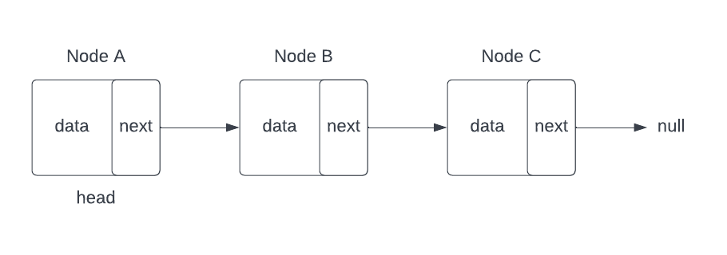

# Linked Lists

## Introduction

A **_Linked List_** is a linear data structure in which elements are not stored *sequentially* in memory like arrays. Individual elements contain the memory address of the next element in the list, wherever that may actually be in memory.

> This notion of holding the memory address of the next element is called a **_pointer_** and is very common. 

First, we should look at what types of artifacts that typically make up a Linked List. More often than not, a ***LinkedList*** class will be composed of not only the parent class, i.e. `LinkedList`, but also a supporting subclass called a `Node`. 

Objects created from this `Node` class will serve as the actual elements of our list and, in its most basic form, only care for two class variables: 
	- The first, and arguably most import piece, is a variable to hold the `data` itself. Here we leverage the power of *generics*, `<T>`, to ensure that this LinkedList can store objects of any type that we specify. 
	- The next class variable that Node will store will typically be of type `Node` and will actually contain the *next node object* in the list (or at least a reference to it). We call this variable `next` to denote that it is the *next* node. 

 What this means is that a LinkedList is **not** a singular collection of elements representing data objects, but rather is a collection of **Nodes** where each Node **knows about its own data and what node comes next** in the list. An array only keeps record of the order of elements and not their data. The Array itself is storing order but the LinkedList is simply storing **references** to Nodes which know about the order of the actual elements of in the collection. You could think of the base structure of a LinkedList as simply:
```java
public class LinkedList<T>{

    private Node<T> head;
    private Node<T> tail;
    private int size;
    
	class Node<T>  {
		// data is the data to be contained within this element and is of type T. 
		// This symbol is an example of using Generics in Java.
		T data;
	
		// next is the next node in the list. 
		// If next is ever pointing to null, we can assume we are at the end of the list.
		Node<T> next;
		// This notion of holding the memory address of the next element is called a pointer and is a very common concept.
	}
}
```

Now that we have a better understanding of the **Node** subclass, lets start to logically uncover the inner workings of a Linked List. As mentioned previously, a linked list is a series of nodes that contain references to the next node in the list. That said, a diagram of the Linked List's flow might look something like this:


In this diagram, Node A is referred to as our **_head_** node and is the first node in the list. Every time we wish to iterate through our list from start to finish, the head node will always be our starting point. Once we have our head node object, we can check the data contained within the `data` variable, and continue moving to the *next* Node object (Node B) which is stored in the variable `next`. We can continue this same series of steps up until the point where we realize that the `next` variable is actually pointing to `null`, not another valid node object. At this point, we have reached the end of our list.

In many implementation of the Linked List class, you would store two important nodes. One is the **head** node, as discussed earlier, is the first node in the list. Two is the **Tail** node, the last valid node in the list. We will discuss more of the tail in the next section as we go over supported operations in Linked List.

## Preview: Linked List Operations
There are many different operations that are important to working with any data structure that are not exclusive to Linked Lists. A few of these operations that we will discuss are as follows:

- **Insertion** : Adding a new element to the list.
- **Retrieval** : Searching for a specific element within the list.
- **Deletion** : Removing a specific element within the list.

## References
- [Singly LinkedList]([examples/java/linked-list.java](https://www.geeksforgeeks.org/data-structures/linked-list/#singlyLinkedList))
- [LinkedList vs Array](https://www.geeksforgeeks.org/linked-list-vs-array/)
- [LinkedList Intro](https://www.geeksforgeeks.org/linked-list-set-1-introduction/)
- [Video: About LinkedList](https://www.youtube.com/watch?v=njTh_OwMljA)
