# Insertion
The Insertion operation is the act of inserting a new element to the list. We can insert data in several ways depending on the needs of the data structure. A few operations to discuss are as follows:

- Inserting to the **End** of an **Unordered** Linked List
- Inserting to the **Front** of an **Unordered** Linked List
- Inserting to the **Middle** of an **Ordered** Linked List

## Inserting to the End of an Unordered Linked List
In an **unordered** linked list (*not sorted*), adding to the end of the list is as simple as creating a new Node object to contain the data, setting its `next` variable to point to null, and updating the **current tail** node to point to our **new tail** node.

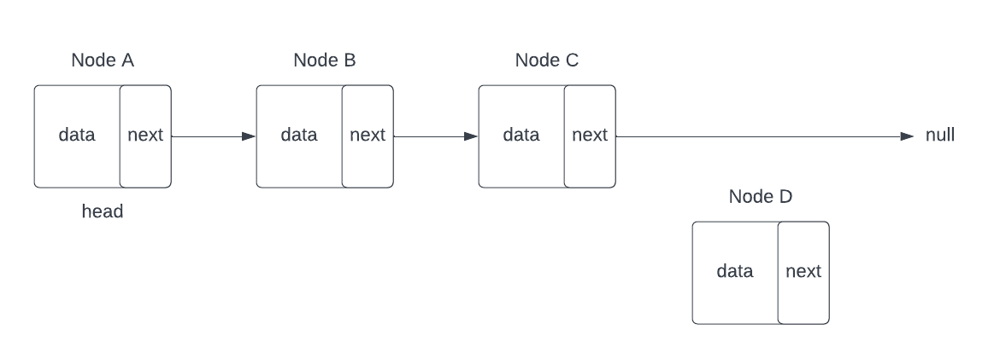
In the diagram above, we can see that a new Node object has been created, but it is currently *floating* in space and is **not linked** within our list.

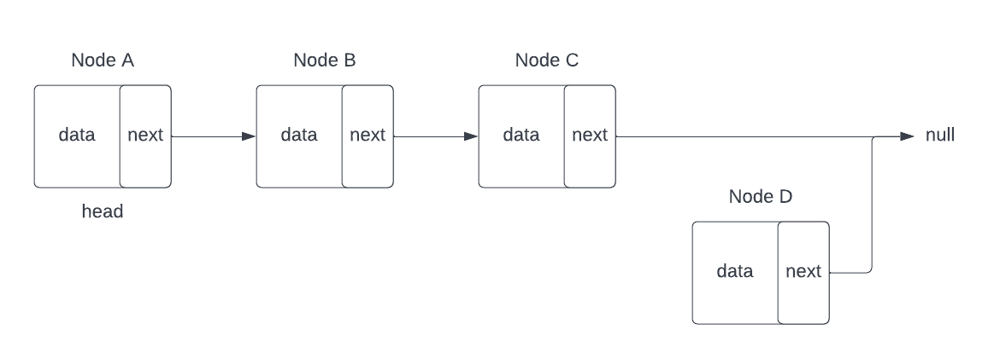
Second, we have to assigned the `next` variable of Node D to null (*shown above*). This will signify that there is no other node after Node D.

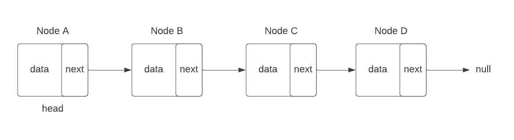
After, we assign Node D's `next` variable to `null`, we still don't have a way to actually *reach* Node D. For that, we need to access our **previous tail node**, *Node C*. We replace *Node C's* `next` value, from `null`, to pont to Node D. This will completely insert Node D as our **new tail node** of our Link List. 
Here we can see that Node C now points to Node D as `next` in the list. Again, if we were actually writing code here, we would want to update the `tail` variable on our Linked List class so that it accurately holds Node D as our new tail.

Here's how the operation would look in java code:

```java
// adds a new element to the end of the list

public void add(T newData){
      // construct the new node object
      Node<T> newNode = new Node<>;

      //assign the data for the new node
      newNode.data = newData;

      // point the previous tail node's next to point to the new node
      // only do this if the size is greater than 0
      // if the size is 0, then this operation would lead to a NullPointerException because our tail is initialized to null
      if(size > 0){
         tail.next = newNode;
      }
      // reassign the 'tail'to point to our new node
      tail = newNode;

      // increment the size
      size++;
}
```

> In many cases, it is advised to keep track of the current size of the list. There are many operations that we will uncover throughout this guide that will ease the trouble. Maintaining the size is as easy as ensuring that for any **insertion** or **deletion** operation, you make sure to **increment** or **decrement** the `size` respectively.

### Inserting to the Front of an Unordered Linked List
Inserting to the **front** of the list is just as simple as our previous example. 

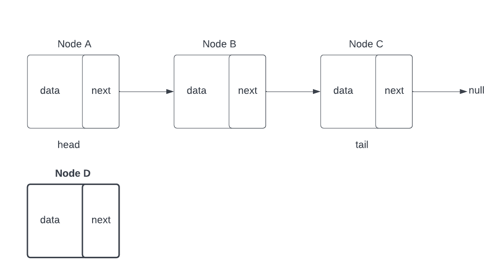
We start with the same step of creating a **new Node** object.

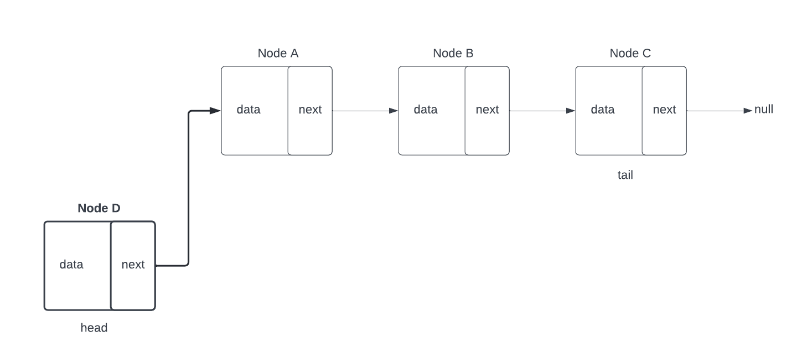
Then, instead of having the **new node** pointing to `null`,  we must point the new node to the **current head**, *Node A*.  
Afterwards, we need update the `head` variable to point to our newly created node as the new *first* element in the list.

### Inserting in an Ordered Linked List
An ordered linked list complicates our operation quite a bit. Because the list is **sorted**, we must take into account that adding to the ends of the list will likely not be an appropriate location for our new node. 
Instead, we must traverse through our list, while comparing the values of each existing nodes to our new node in order to determine the correct location to insert.

Below we list the steps in ording our Linked Lists from smallest to largest:

1. Create our new Node object to hold our data
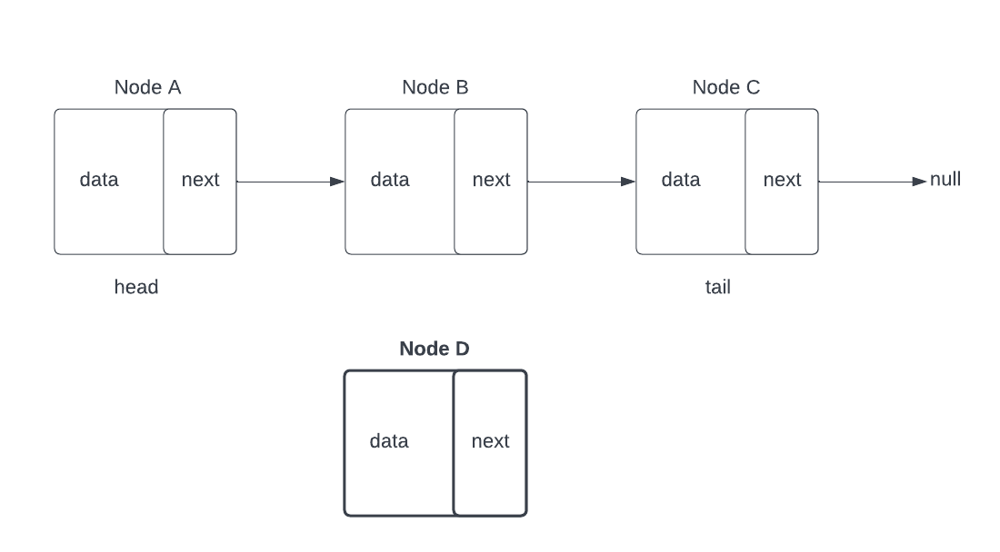

2. Begin our traversal by comparing our new node to the current 'head' node:
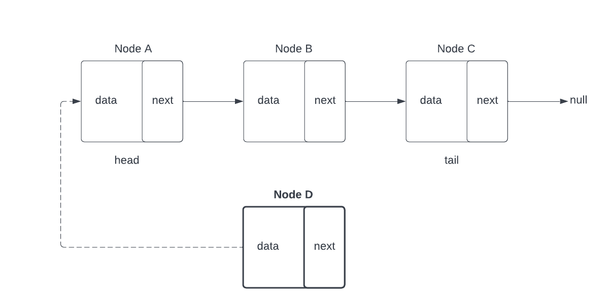
   - If our new node is **smaller** than the **head node**, our new node should become **first in the list** so we simply repeat [[#Inserting to the Front of an Unordered Linked List]].
   - If our new node is **larger** than the **head node**, we need to continue our traversal by grabbing the next node and repeating the comparison until we either find a condition where our new node is **smaller**, or we reach **the end of the list**.

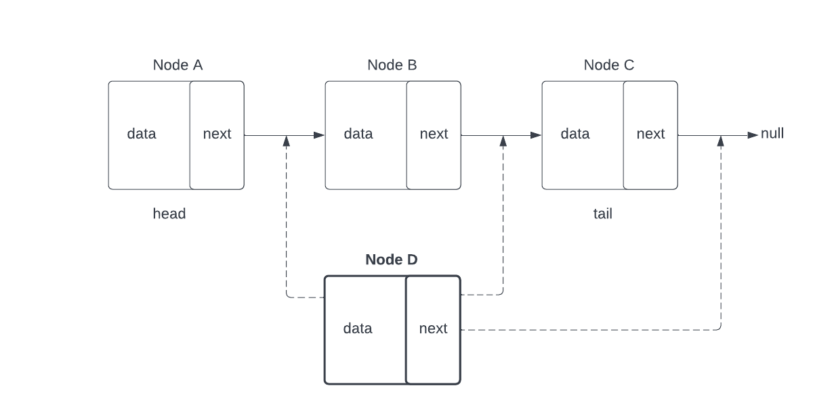
- If we reach the end of the list (where `next` is `null`), then follow steps from: [[#Inserting to the End of an Unordered Linked List]]. 
- If our new node does not belong at either end of the list, continure on to next step.

3. In order to insert in the **middle** of the list, a few things must occur to keep everything linked. Lets assume we are inserting a new node, Node D, between Node B, and Node C:
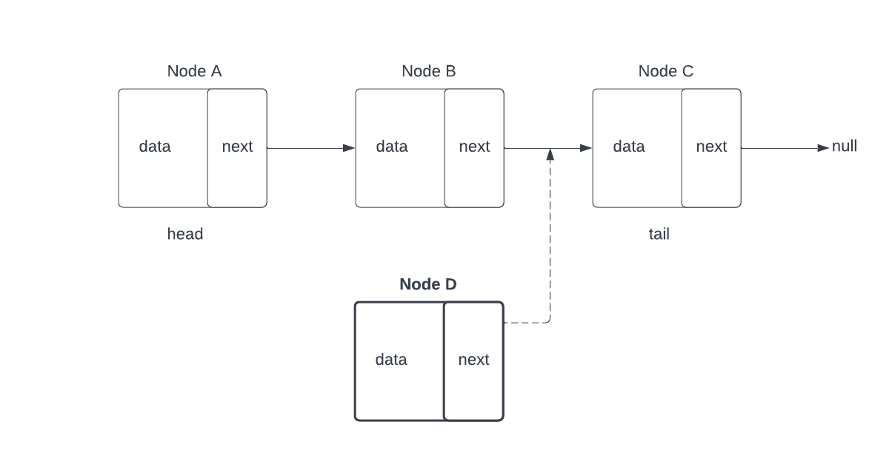  
   - Node D will be before Node C, so we must point the `next` variable on Node D to point to Node C.
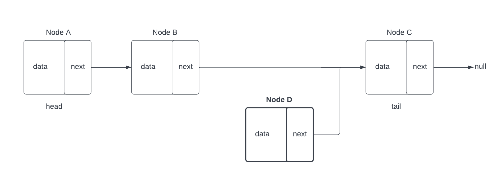
   - Node D will be after Node B, so we must point the 'next' variable on Node B to point to Node D.
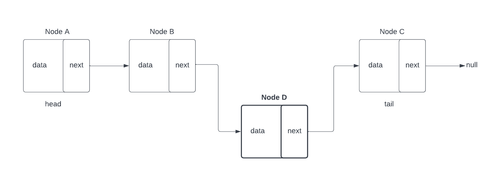
In theory, this insertion operation can seem relatively straightforward, but as we'll see in our later code examples, there are several things to consider in implementing this process.