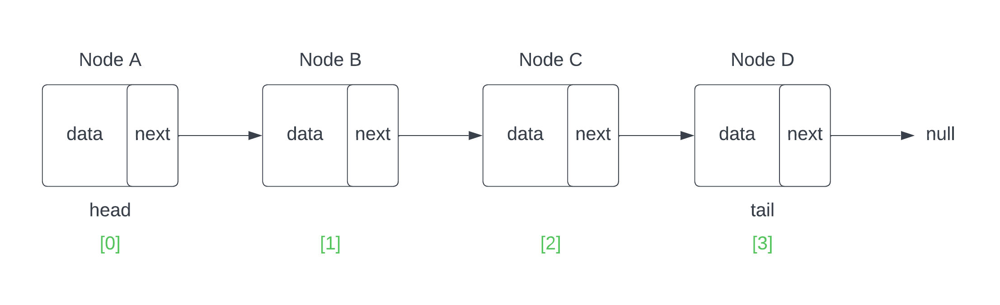

## Retrieval

When discussing the retrieval of data from a linked list, we typically still refer to elements by their index, despite there not being true a index relationship to the elements like there would be with an array or an ArrayList. However, we can still consider an element's location in the list as their index, starting from 0. Therefore, our head Node would be at index 0, and our tail Node would be at an index equal to the length of the list minus one (to account for the list being indexed at 0).

In order to physically retrieve the data, we must iterate through the list n spaces, where n is the desired index. Once we reach the desired index, it is as simple as returning the data contained within the node at that location. The name for the actual retrieval function is typically called 'get' and in many languages and implementations, can be overloaded to accept different types of parameters instead of just the index.

Lets look at how this retrieval may look in a diagram and then we will follow it up with an implementation in code.

Assume that we have the same four node list from earlier as seen below:


Since our primary retrieval will be index based, we should now consider the indices for the list, remembering to start from 0.



As we can see from the diagram above, our four node list has the following indices that we can retrieve: 0, 1, 2 and 3. If the 'get' method was called with a provided parameter of 2, the retrieval would be as follows.

- Begin with the starting node of the list (head), which is at index 0 and contains a reference for the 'next' node.
- Initialize a loop to iterate n number of times (n being 2 in this case)
- In the body of the loop, all we need to do is progress the pointer with each iteration. We do this by re-assigning our current node (which at the beginning of the loop is head) with the value of the 'next' node.
- If our loop is set to iterate two times, we will call 'next' two times, and thus end on the third item in the list at index 2.
- Once we are at the desired location, we return the data value stored within the node.

Here's how this operation might look in Java code:

```java
public T get(int index){
        
        //store the current head node in a local variable
        Node<T> current = head;

        //begin a loop that should iterate n number of times with n being the index
        for(int i=0; i < index; i++){
            // for each iteration, 'move' the pointer by reassigning our current node with the value of current.next which should be the next node in the list
            current = current.next;
        }
        //once the loop has finished iterating, we know that the current node should hold our desired data, so we return current.data
        return current.data;
}
```

The above implementation is fairly basic and is not protected against any user error if the method were to be called with an index that is outside of the range of our list. For instance, if our list only had four elements, if the method was called with any value higher than 3, we would end up with a NullPointerException as our loop continued and tried to call either 'next' or 'data' on a null value.

Similarly, if the method is called with a negative value, our loop would never iterate to begin with, thus leading us to return the value of the head node. In the second case, we wouldn't get an explicit exception to let us know something is wrong, instead we would just have undesired functionality. For these reasons, we would likely want to have a check against the provided index before the loop iterates just to make sure that it falls within the bounds of the list.

// [https://github.com/revature-curriculum/linkedlist-sample](LAB) //