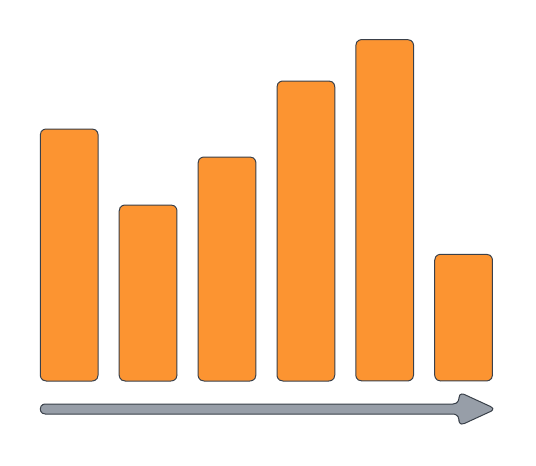
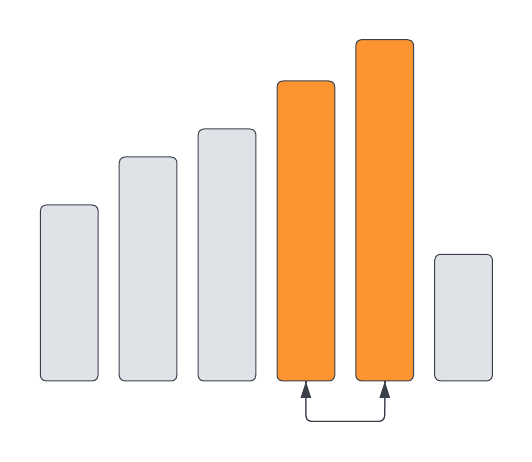

# Bubble sort
In this module, we will learn how we can **sort** the data in a list or an array. There are many different sorting algorithms out there each with different _complexity_ and _efficency_. One of the simplest sorting algorithms, and the one we will be discussing in this module, is **Bubble Sort**. 
Bubble Sort takes an element and compares it to the _next_ element in the list. If the element is _greater_ in value, they **swap places**, if **not** we **move on to the next pair** of elements. This sorting method will take the elements with the **largest values and move them 'up' to the end of our list**. Just as air bubbles in water would float up to the surface of the water; hence the name. Thus, to further understand the inner workings of this sorting algorithm let's dive deeper into the first iteration through our list: 

<br/>

The first iteration of bubble sort will go through **each element of the list** and _compare_ it to the **next element**, with the _exception of the last one_ since there is nothing after it.

If an element is **greater than** the next element in the list they **swap** places. Then we move on to compare the next pair of elements in our list. 

<br><br>
<br><br>

If the element is not greater than the next one in the list, then they **do not** swap places, as we still move on to compare the next pair of elements **until we reach the end of our list**. 

<br><br>
<br><br>

It is at this point that we have reached the end of our first iteration. However, in most cases, the first iteration will just move our largest value to the 'top' (end) of the list, while **the rest are still out of order**. 

<br><br>

Thus, we have to iterate through the list **again**, following the same procedure as we did before. Once we do that, it may still not be sorted, making us have to iterate through our list... **again!** The goal is to finally reach a full iteration where **none of the elements in the list swap places**. Once this happens it means that our list is finally **sorted** and we can _stop_ iterating through our list. It takes a while and is what makes Bubble Sort one of the most inefficient sorting algorithms out there with the complexity of **O(n^2)**. In the best-case scenario, only where the list is already sorted, it would be O(n).
<br><br>

Here is how one will organize their code: 
``` Java
bubbleSort(array){
    While (a swap occurs){
    // as long as something is swapped the While loop condition should equal TRUE, so the algorithm can continue to run until ordered. 
    // Once ordered, nothing should swap, which then we can convert our While loop condition to FALSE, breaking us free from the loop. Otherwise, we will continue to loop forever.
      for (int i=0; i < array.length-1; i++) {
        if (leftElement > rightElement)
            // logic to swap left and right elements will go here. 
        }
    }
}
```

For reference, here how the code would look like in Java:
``` Java
bubbleSort(array){

    boolean swappedSomething = true;
    
    // looping until fully sorted 
    While (swappedSomething){
        
        // optimistic thinking that the current iteration will contain no swapped elements and will end the while loop
        swappedSomething = false;
        
        // here is the iteration through our array, once per while loop
        for (int i=0; i < array.length-1; i++) {
            
            // checks to see if compared values are in their proper place.
            if (array[i] > array[i+1]){
                
                //checks off that elements swapped places and will initialize another iteration
                swappedSomething = true;
                
                // stores the first element as a temporary variable
                int temp = array[i];
                
                // swapped the first element with next element
                array[i] = array[i+1];
                array[i+1] = temp;
```


### References
https://www.geeksforgeeks.org/bubble-sort/

https://www.programiz.com/dsa/bubble-sort

https://www.youtube.com/watch?v=g8qeaEd2jTc