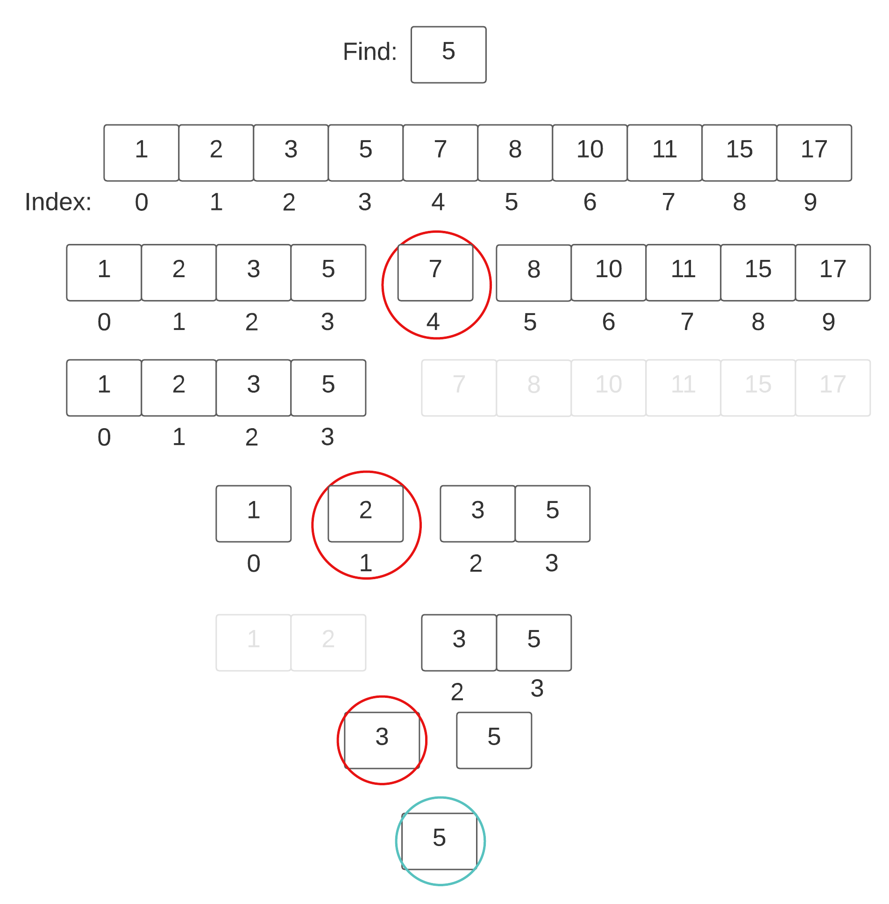

# Binary Search
Were you able to implement a Binary Search? If yes, that is great! If not, do not worry. Here we go more in depth for you.

Like stated before there are multiple ways of doing a Binary Search. There is an Iteration Method, and a Recursive Method. Both of them have different time complexity, hench one is faster than the other. A Binary Search through a Recursive Method would be of time complexity `O(log n)`, as for an Iterative Method time complexity would be `O(n)`. This make the Iterative Method more efficent than a Recursive Method.

## Iterative Approach
To review, here is the pseudo-code of an Iterative approach, provided in the previous section:
``` Java
    binarySearch(arr, x, first, last)
        repeat till frst = last
               mid = (frist + last)/2
                   if (x == arr[mid])
                   return mid
   
                   else if (x > arr[mid]) // x is on the right side
                       first = mid + 1
   
                   else                  // x is on the left side
                       last = mid - 1
```
Here we conduct all of our logic within one method, `binarySearch()`. Our parameters here are: The array we are searching in (`arr`), the element we are searching for (`x`), the lowest/first value in the array (`first`), and the highest/last value in the array (`last`). 

- First we want to creat a loop that would iterate through the array until we find the element with the same value we are searching for, or until the search finihes. We can do this with a `while` loop that contains a boolean condition that will flip only once we find a match, or iterated through the end of the list.

- Next we want to split the list into two at the middle element. Thus, we take the first and last indexes, add them together and divide by `2`. Setting our `mid` variable to an `int` will automatically round down for us condidering an `int` value can not hold decimals.

- Establishing the **middle element** creats two **sub-arrays** on either side of it. We first will compare the **middle element's value** with the value we are searching for. 
    - If they **match**, then we found the element we want and we `return` the index of the middle element. 
    - If our element is **greater than** the middle, we conduct *another search* in the sub-array to the right side. 
    - If **less than**, we search through the sub-array on the left side.

- We repeat this process of *dividing* up the list into smaller and smaller *halves*. Comparing the **middle elements** until we find a match with the value we are searching for, or once we run into an end to the list.

Here is a diagram to illistarate what is happening:


## Recursive Approach
The logic for a Recursive approach would follow as:
``` Java
    binarySearch(arr, x, low, high)
           if low > high
               return False 
   
           else
               mid = (low + high) / 2 
                   if x == arr[mid]
                   return mid
       
               else if x > arr[mid]        // x is on the right side
                   return binarySearch(arr, x, mid + 1, high)
               
               else                        // x is on the right side
                   return binarySearch(arr, x, low, mid - 1) 
```
Here we reuse our `binarySearch()` method within itself. Using the method within itself is called Recursion in software development. 