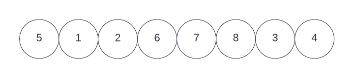
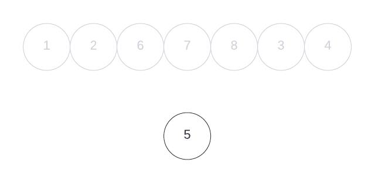
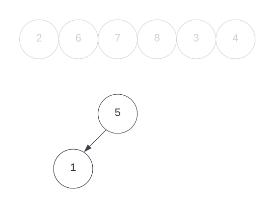
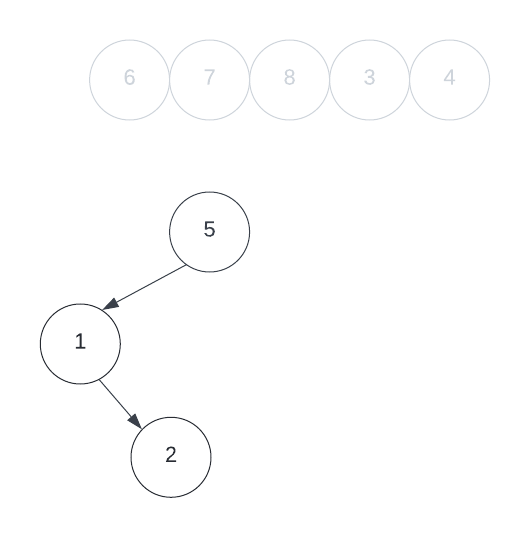

# Insertion into a Binary Tree
**Insertion** to a binary tree has two approaches: 
- an **iterative**, or 
- an **recursive** approach 
 
The longer of the two is the **iterative** approach, thus let us start there.

## Iterative Insert into Binary Tree
With both approaches, you will need to create a condition that traverses through the tree determining if the value is *greater than* or *less than* the current node. This comparison is to ensure we place our new node in the correct child branch from its relative root (i.g. the node above it). If not, we may be inserting nodes in inappropriate places in our tree. Keep in mind, that the child node that branches to the **left** will be *less than* the current node, and the child node that branches to the right is *greater than*.

Thus, theoretically, if we were given this list of numbers to insert into a Binary Tree

We will first insert the first number `5` at the top. `5` will be our **Root** value and the main gateway to our tree structure. The **Root** will be revisited and traversed every time we insert a new element into the tree.

Now we will take the next value `1` and determine whether it will branch out from our root leftwards or rightwards. To do this we compare our **Root's** value with the new incoming **Node's** value. Since `5 > 1` our new *Node* will branch leftwards. Since there is no Node already to the left of `5` we can place `1` here and continue inserting the other elements into our tree. 

The next incoming node is `2`. Thus, we need to now revisit our **Root** and determine whether the incoming node will branch left or rightward. In this case, it will traverse leftward since `5 > 2`. However, now we check if there is a Node present to the left of `5` or not. Since we just placed `1`, there in the previous step, we must compare `1` with our incoming value of `2`. Since `1 < 2` we traverse toward the right. Again, we need to check if there is a node to the right of `1`, and since there isn't the incoming value, `2`, then becomes the value of the new node to the right of `1`.

We will repeat this process until all the elements have been inserted into our tree, resulting in the tree structure below:

This is only one way our data set can be organized in a Binary Tree. Unfortunately, this tree is not the most useful since it is not **balanced**. The diagram below is a more balanced tree where elements are distributed as evenly as possible across each node. To ensure this structure we have to develop our insertion method in a way that will filter elements into a balanced structure. This requires possible reorganizing our list, creating a condition that swaps values for nodes, or other means. Another, and more practical way of doing so, is by ***rotating*** the tree's values; but that will be for another time.


Now to code this! Let us break down each step in how to **insert** each node into our tree **iteratively**.

Our insert method will return `void` but create a tree system that refers to our `Node` class shown below:
```Java
public class Node{
	int data;
	Node left;
	Node right;
	Node(int x){
		data = x;
	}
}
```
This `Node` class is what creates our **Binary Tree** structure, and is the backbone of it all.

The `insert` method signature will contain two parameters, one that refers to a **Node** of our Binary Tree, and the other for the **value** of the *new node* we want to insert, `val`.
```Java
// We can insert any node in place of temp. The method will simply begin traversal from said node
static void insert(Node temp, int val){...}
```
The first value that needs to be inserted into a tree is ideally the `root` value but does not have to be. Afterward, we have a condition statement that checks if there is a value at the passed-through node object or not. If **not**, add a new node using the value of `val`. If a node **does exist**, then continue traversing through the tree from the said node.
```Java
//we will pass our node through using the temp parameter
static void insert(Node temp, int val){
	if(temp == null) temp = new Node(val);
	else{...}
```
This is usually done with the root value. It is common to assign `temp` in our if statement above to refer to our `root` node as a starting point. 

Now that we have our `root` set, we can add the other numbers. To do so, we need to compare the next number in the data set with the **root**. If the new number is **greater than** the *root* it has to go to the **right** and **left** if it is **less than**. 
```Java
// Here we pass the root node through our Node parameter, temp, and compare its value to our new value, val. 
if(temp.data <= val){
	
	//If val, is greater than our temp node, we set our new value to the right node from our root
	temp.right = new Node(val);
	
}else{ //if(temp.data > val)
	
	//If val, is less than our temp node, we set our new value to the left node from our root
	temp.left = new Node(val);
}
```
However, this only traverses through the root node and **not** its child nodes. The tree we are inserting in may have many elements already, and we need to traverse through all of them, on the correct path, until we find the correct spot for the new value. To do that, we need to iterate through our method. We can do this by inserting a `while` loop and using the `left` and `right` Node fields within our `Node` class to traverse through the correct path. 
```Java
//This will always loop until we reach one of the "break" statements below.
while(true){

	if(temp.data <= val){
	
		//This checks if there is a node to the right already...
		if(temp.right != null){
		
			//... if there is then we reassign temp to equal right node and restart the loop.
			temp = temp.right;
			
		}else{
			
			//if there isn't a right node, we will set the new val to the right node
			temp.right = new Node(val);
			//once our new val is assigned to the node, we can break from the loop
			break;
		}
	}else{//(temp.data > val)
	
		//This checks if there is a node to the left already...
		if(temp.left != null){
		
			//... if there is then we reassign temp to equal left node and restart the loop.
			temp = temp.left;
			
		}else{
			
			//if there isn't a left node, we will set the new val to the left node
			temp.left = new Node(val);
			//once our new val is assigned to the node, we can break from the loop
			break;
		}
	}
}
```
Finally, we can put it all together:
```java
//This is our main method signature, we take in a node value, temp, ideally the root node of a tree, but doesn't have to be.
static void insert(Node temp, int val){
	
	//here we see if there is a root node already, if not, we assign the new value to the root node.
	if(root == null) root = new Node(val);
	
	//if the root already exists, then continue into the while loop to see what side of the tree it will traverse through
	else{
		while(true){
			
			//if greater than the root node, then traverse rightward 
			if(temp.data <= val){
			
			//if there is a node there already, continue, from that node, to traverse through the appropriate side of the tree
				if(temp.right != null){
				temp = temp.right;
				}else{
				
				//if there isn't a node to the right already, create a new node in this place with the new value
				temp.right = new Node(val);
				break;
				}
			//if less than the root node, then traverse leftward	
			}else{
			
			//if there is a node there already, continue, from that node, to traverse through the appropriate side of the tree
				if(temp.left != null){
				temp = temp.left;
				}else{
				
				//if there isn't a node to the left already, create a new node in this place with the new value
				temp.left = new Node(val);
				break;
				}
			}
		}
	}
}
```
 ## Recursive Insertion into Binary Tree
 The **Recursive** approach has a cleaner and arguably simpler approach. Below is the full recursive method:
```Java
// We have the same method signature with the same parameters
static Node insert(Node temp, int val){
	// We still check IF the root node/Passed-Through node, exists or not.
	if(temp == null){
	
		// If the node does not exist, assign the new value as the new node.
		temp = new Node(val);
		
		// return the new node
		return temp;
	}
	// If there is a node we have to compare the new value with the value of our passed-through node
	
	//If the value of our passed-through node is greater than the new value, 
	// pass through the node to the left into our method
	if(temp.key > val) temp.left = insert(temp.left, val);
	
	//If the value of our passed-through node is less than the new value, 
	// pass through the node to the right into our method
	else temp.right = insert(temp.right, val);
}
```
Here, the initial `if` block will be the node creation function, as the other blocks will recurse through the `insert()` method and handle traversing through our Binary Tree/assigning *leaf* nodes new data.

## Further Reading
- [Geeks For Geeks: Insertion in a Binary Tree in level order](https://www.geeksforgeeks.org/insertion-in-a-binary-tree-in-level-order/)
- [Insertion in a BST](https://www.techiedelight.com/insertion-in-bst/)
- [Insert into a Binary Search Tree (Algorithm Explained)](https://www.youtube.com/watch?v=RIDBLO-S7OA)
