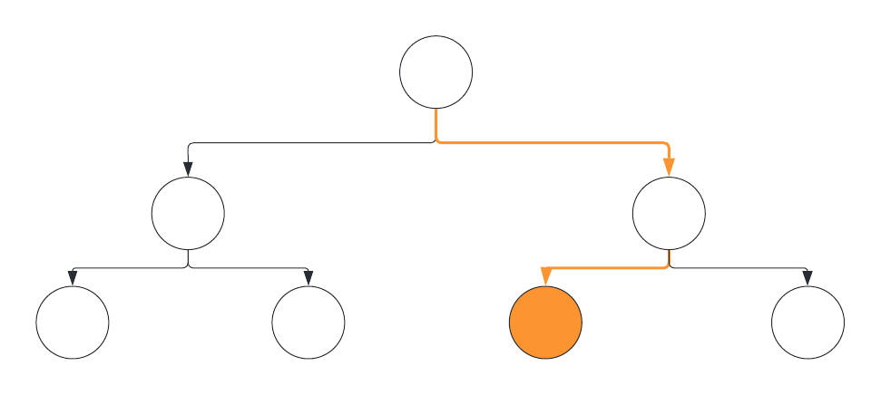
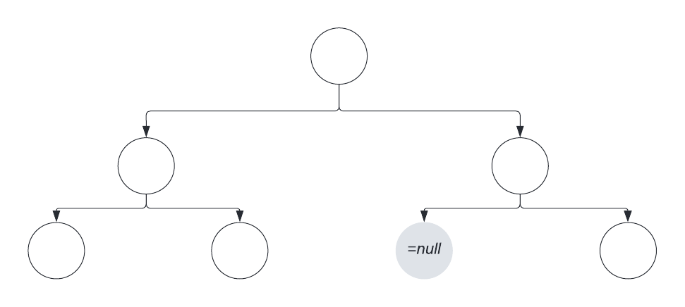
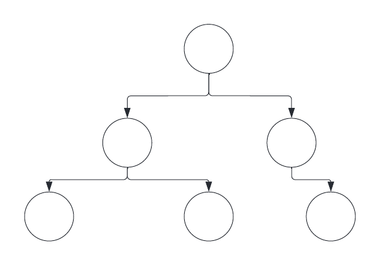

# Deletion from a Binary Tree
Now to delete an element, or node, from our Binary Tree. Here we need to consider 3 things: What node we want to delete, does the node have any child nodes and, *if it does*, how do we maintain those child node within our tree structure. Seems pretty easy to understand but can be hard to execute. You will need to understand and implement all of the other lessons in this module to succesfully Delete a node under any circumstances. We will break the lesson down into three sub-sections: **Deleting a Chidless Node**; **Deleting a Node with One Child Node**; and **Deletingh a Node with Two Child Nodes**. In each section we will use our `Node` class:
```Java
public class Node{
	int data;
	Node left;
	Node right;
	Node(int x){
		data = x;
	}
}
```
and we will be developing the `DeleteNode()` method. The further along we go through the lesson the more our method will grow and become more complex. Our method will return `void` since there will be no node to return. However, to check if the node is deleted we can simply print out the tree using an in-order print method (*used in the labs to print out your data set*). Our method will take in 2 parameters: our `root` Node, and the value of the node we want to delete `val`.
```Java
public static void DeleteNode(Node root, int val){}
```
## Deleting a Childless Node
This is the simpliest way of deleting a node. Here we can conduct a simple search through our Binary Tree, and then set the node we want to delete to `null`. 

In the diagram, we will follow the orange path until we reach our desire node, and then set that node to null. This will get rid of the node from our tree.



Here we set the orange node, *the node we want to delete*, to equal `null`.



Since the node now equals `null` it will no longer appear in the data set, leaving our Binary Tree structure to look like this:



The diagrams above makes the process look simple, but can be a bit more complicated to code. We can not just simply search for the node and set itself to `null` as such: `node = null;` That will not work with the way our `Node` class is constructed. Since the `Node` class's only refences to another node is to its child nodes, we can only set child nodes to `null`. Otherwise we delete all the data the exist below said node. Thus:e first thing we need to do is search for the node that we want to delete. To do that we have to alter the `SearchBT()` method from the previous lessons to make it work for deletion. 
```Java
static static void deleteNode(Node root, int val){
	//We still have a temporary Node variable
	Node temp = root;
		//We still iterate through the method using a while loop
		while(true){
			
			//Traversal down layers is still done the same way
			if(temp.data < val){
				temp = temp.right;
			}else{
				temp = temp.left;
			}
		}
}
```
Now lets add what is different. Since we are searching 
```Java
public static void deleteNode(Node root, int val) {
	Node temp = root;
	
	while(true){
		
		//We check if the left child node is equal to the node we want to delete
		if(temp.left!=null && temp.left.data == val){
			
			//if yes, we set the child node to null
			temp.left = null;
			break;
		}
		
		//We check if the right child node is equal to the node we want to delete
		if(temp.right!=null && temp.right.data == val){
			
			//if yes, we set the child node to null
			temp.right = null;
			break;
		}
		
		if(temp.data > val){
			temp = temp.left;
		}
		else{
			temp = temp.right;
		}
	}
}
```

```Java
public static void deleteNode(Node root, int val) {
	Node temp = root;
	
	while(true){
		
		//We check if the left child node is equal to the node we want to delete
		if(temp.left!=null && temp.left.data == val){
			
			//if yes, we set the child node to null
			temp.left = null;
			break;
		}
		
		//We check if the right child node is equal to the node we want to delete
		if(temp.right!=null && temp.right.data == val){
			
			//if yes, we set the child node to null
			temp.right = null;
			break;
		}
		if(temp.data > val){
			
			//If the relative child node does not exist 
			//then there isn't a node of the value we want to delete so we finished
			if(temp.left == null) break;
			
			//If it does exist, we traverse left
			temp = temp.left;
		}
		else{
			
			//If the relative child node does not exist 
			//then there isn't a node of the value we want to delete so we finished
			if(temp.right == null) break;
			
			//If it does exist, we traverse right
			temp = temp.right;
		}
	}
}
```


## Deleting A Node with One Child
If we want to delete a node with a child we will have to replace our deleted node with the child, or else we will also delete the child node. 


## Deleting A Node with Two Children

