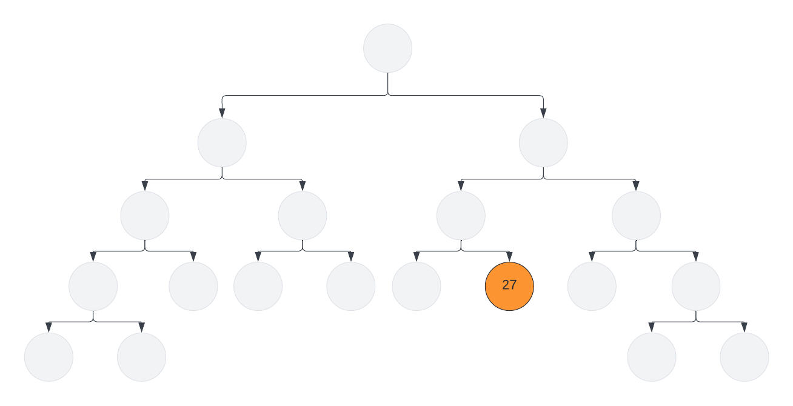
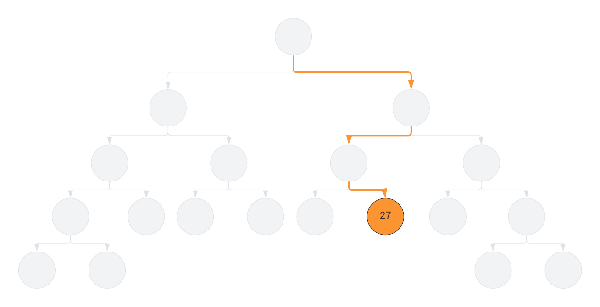

# Retreiving from a Binary Tree

We need to retrieve something from our Binary Tree... Easy! No really! The way a Binary Tree is constructed, *if balanced*, is meant to make our searching easier and faster! Why? Because, when searching we only have to search through half of our data structure, and the half of that the further down we go in layers. 

For example, let us say we have a data structure like the diagram below and we are searching for the value `27`.


Here we traverse through the tree towards the right, then left, then right again. We ignore all of the paths that do not lead to the desired node allowing us to only make 3 moves.

For example, our traversal follows the orange line in the diagram below:


This shows how convenient it is to search in a hierarchical data structure. However, if we were to organize the same data in an *ordered list* we will need to iterate through 9 other nodes *before* we even get to our desired node of `27`.  This is what makes Binary Trees so useful in terms of time efficiency.

However, this only becomes efficient if the tree is balanced. If the tree were to look more linear or lean towards one side or the other then we lose this efficiency when searching for elements that live in those one-directional trees. In such cases, it would make sense to use an array data structure. However, if we are meant to keep a tree structure, we will have to *rotate* our tree to balance it.

## Iterative Binary Tree Retrieval
For the sake of this lesson, we will consider a balanced tree and search for any node.

We will be using our Node class below as a reference:
```Java
public class Node{
	int data;
	Node left;
	Node right;
	Node(int x){
		data = x;
	}
}
```
We need to take in a couple of parameters for our search method signature: our `root` node; and the value of the node we are searching for, `val`.

```java
static Node SearchBT(Node root, int val){
// add logic here...
}
```

First, we need to traverse through our `root` node to determine which half we continue in. Thus, we compare the value of our `root` with the value of the node we are searching for. Whether `val` is *greater than* or *less than* our `root` will determine which direction we continue to search for our desired node.
```Java
static Node SearchBT(Node root, int val){
	if(root.data < val){
		// traverse to the right
	}else{
		// traverse to the left
	}
}
```
In the *iterative* approach we need to establish a temporary node, hench `temp`. We will initially assign `Node temp` to our `Node root`. However, once we establish a direction to traverse through, we will re-assign `temp` to either the right or left node from it. 
```Java
static Node SearchBT(Node root, int val){
	
	//root becomes temp value temporarily 
	Node temp = root;
	
	//temp will take place of root
	if(temp.data < val){
		temp = temp.right;
	}else{
		temp = temp.left;
	}
}
```
After setting our traversal we need to set a condition for when we *actually* ***find*** our desired node, and **return that node!**
```Java
static Node SearchBT(Node root, int val){
	
	//root becomes temp value temporarily 
	Node temp = root;
	
	//If our node value = the value we are searching for we found our desired node
	if(temp.data == val){
		return temp;
	}
	//temp will take place of root
	if(temp.data < val){
		temp = temp.right;
	}else{
		temp = temp.left;
	}
}
```
 Now that we have our traversal in place we will need to iterate through the data structure. So let us loop this method so we can continue the traversal until we find our desired node or reached an end.  We'll use a `while` loop so that traversal will continue for as long as the data structure extends down.
```Java
static Node SearchBT(Node root, int val){
	
	Node temp = root;
	
	// this will loop through the traversal until we find our node
	while(true){
		if(temp.data == val){
			return temp;
		}
		if(temp.data < val){
			temp = temp.right;
		}else{
			temp = temp.left;
		}
	}
}
```
We are missing just one more thing. **Think**... what would happen if we were to search for a value that did **not** exist? Yes, we need a condition for `null` values too! If not we will face an exception!

```Java
static Node SearchBT(Node root, int val){
	
	Node temp = root;
		while(true){
		
			//will return null if the node doesn't exist
			if(temp == null) {
			return null;
			}
			
			if(temp.data == val){
				return temp;
			}
			if(temp.data < val){
				temp = temp.right;
			}else{
				temp = temp.left;
			}
		}
}
```
Done! Now we can call this method every time we want to search for a node in our Binary Tree.

## Recursive Binary Tree Retrieval
The approach above is done **Iteratively** and can, like the other basic Binary Tree methods, be converted to a **Recursive** approach. This would simply get rid of our while loop and our `temp` node, constructing a method that looks like this: 
```Java
static Node SearchBT(Node root, int val){
	if(root == null){
		//returns if node does not exist
		return null;
	}
	if(root.data == val) {
		//returns if node exist
		return root;
	}
	if(root.data < val){
		//traversal to the right
		return SearchBT(root.right, val);
	}
	else{
		//traversal to the left
		return SearchBT(root.left, val);
	}
}
```
The recursive solution will call itself as it *concats* `.left` or `.right` to the `root` parameter of our `SearchBT()` method. This is how we traverse through the Binary Tree.

