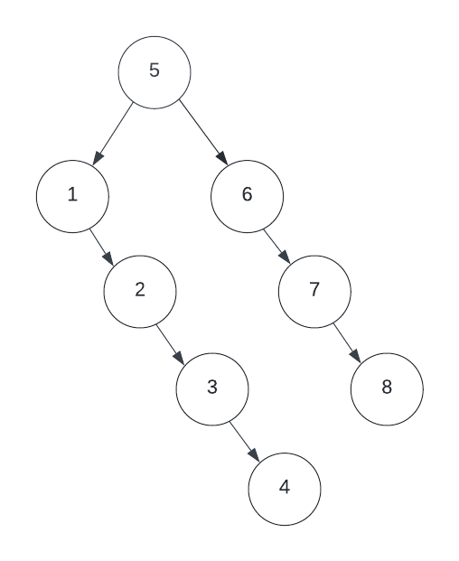

# Deletion from a Binary Tree

In theory, deletion from any data structure can seem as simple as `find the element with the data matching what you want to delete` and then `delete it`. However, when it comes to hierarchichal data structures, we have to carefully consider how to reposition the other members of the hierarchy. For instance, if we have the following tree:



When deleting the number 2 node, what should happen with its child, 3 and 3's child, 4? In order to avoid unintentional data loss, we must replace any deleted nodes with the correct node to maintain the tree structure. In the example above, this seems a very simple replacement. However, when the hierarchy becomes more complexly nested, many issues begin to arise. For instance, what if we wanted to delete the root node, 5? Well now we have to choose a successor, to which you might be considering we must go with a direct child of the deleted node. If we choose 1 to be the successor, its children would all need to change in order to maintain the Binary Tree principles. This can be quite taxing, so instead we typically choose an `in-order successor or predecessor` meaning if the number to be deleted was 5, if we were choosing a successor, we would find the next closest node in size to 5. In our case, 6 happens to be a direct child, but this is not always the case. With 6 as our successor, the replacement still remains relatively simple, but again, in more complex structures, this can start to get quite confusing.

As I'm sure you're beginning to realize, implementing deletion in a Binary Tree can be quite the task, but in any case, recursion is often the key to a clean solution. 

Due to the complex nature of Binary Tree deletion, you will not be required to implement it from scratch during this module's labs. However, you will find the implementation listed below to further your understanding of the operation.

When performing deletion, there are three main conditions to consider after locating the node to be deleted:

- The node has NO children
    - This is typically our best case scenario as it requires no further shifting of the tree. Simply replace the pointer to the current node with null
- The node has ONE child
    - This is a middle ground scenario and is still quite simple to solve for. Instead of replacing the pointer to the current node with null as we did in the previous case, we must instead replace the current node with its only child, whether that be LEFT or RIGHT. 
- The node has TWO children
    - This is our worst case scenario and will typically involve a series of node replacements instead of just pointing to null. In this case, we must do as described above and locate an in-order successor or predecessor. In either case, once found, we replace the node to be deleted's value with that of the successor, essentially swapping the values. Then, we must continue down the tree to delete the successor. However, once we locate the successor to delete it, we must start the process over again with that node and consider the same three conditions. This is why recursion can be a great tool when solving for Binary Tree deletion.

```Java
    public void delete(int data){
        // Find the node
        // we reassign root here just in case the node to delete is root
        // if root is not the node, it remains unchanged
        this.root = this.deleteNode(this.root, data);
    }

    private TreeNode deleteNode(TreeNode current, int data){
        // null check for current
        if(current == null) return current;

        // If the node is found
        if(current.data == data){
            // AND has no children
            if(current.left == null && current.right == null){ 
                // delete the node
                return null;
            } 
            // OR has one child
            //  replace the node with the existing child
            else if(current.left == null){
                return current.right;
            } 
            else if(current.right == null){
                return current.left;
            }
            // OR has two children
            //  choose either the inorder predecessor or successor to replace
            else {
                // for inorder successor, get the smallest in the right subtree
                TreeNode temp = smallestNode(current.right);
                // assign the value of the successor to current
                current.data = temp.data;
                // delete the inorder successor since we're moving it up in the tree
                current.right = this.deleteNode(current.right, temp.data);
                return current;
                
            }
        } else if(current.data > data){     // go left
            // assign the value that is returned in case we need to replace a node
            current.left = this.deleteNode(current.left, data);
            return current;
        } else {                            // go right
            // assign the value that is returned in case we need to replace a node                 
            current.right = this.deleteNode(current.right, data);
            return current;
        }
    }

    private TreeNode smallestNode(TreeNode node){
        while(node.left != null) node = node.left;
        return node;
    }
```