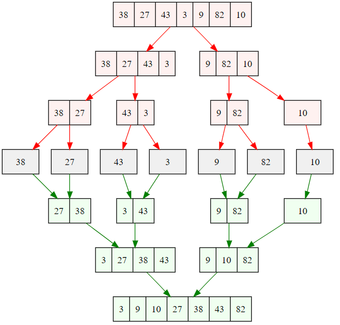

## Merge Sort Intro


 Alright, don't get scared by this one, but this is one of the most visually confusing sorting algorithms out there. 
 
 Like **Binary Search** we are going to use the *"divide and conquer"* principle to take a list and sort it. The list in a *Merge Sort* is divided into multple sub-arrays, like a binary search. A *Recursion* solution can be used instead of a iterative solution. In the end, we take all the sub-arrays and conbind them in order. We use a `mergeSort()` method along with a `merge()` method to do this algorithm.   

Here is Pseudo-code to demonstrate the coding process:
```java
mergeSort(arr[], arr.length{
	//
	if (arr is length 1){
		return;
	}

	//divides arr[] into two
	mid = arr.length/2; 
	
	//left side
	leftSub = new int [] size of mid 
	
	//right side
	rightSub = new int [] size of arr.length - mid 
	
	//copy all elemnt on left side	
	for(each elment till index mid){
		copy arr[] into new leftSub[]
	}
	
	//copy all elemnt on right side	
	for(each elment from index mid till index of arr.length-1){
		copy arr[] into new rightSub[]
	}

	//recursive for both sub arrays 
	mergeSort(leftSub[], mid);
	mergeSort(rightSub[], arr.length-mid)

	// another method within this main mergeSort()
	merge(arr, leftSub[], rightSub[], mid, arr.length-mid)
}

merge(arr[], leftSub[], rightSub[], mid, arr.length-mid){
	
	while(we have not reached the end of both Sub[]) {
		if (leftSub[] at an index <= rightSub[] at an index){
			copy leftSub[] value at index into arr[]
			increment indexes up in leftSub[] and arr[]
		}
		else {
			copy rightSub[] value at indes into arr[]
			increment indexes up in rightSub[] and arr[]
		}
	}
	while(there is still elements left in leftSub[]){
		copy those elements into remaining slots of arr[]
	}
	while(there is still elements left in rightSub[]){
		copy those elements into remaining slots of arr[]
	}
}

```
Now to try it yourself... Good Luck!
==\< Lab Link Goes Here\>==

