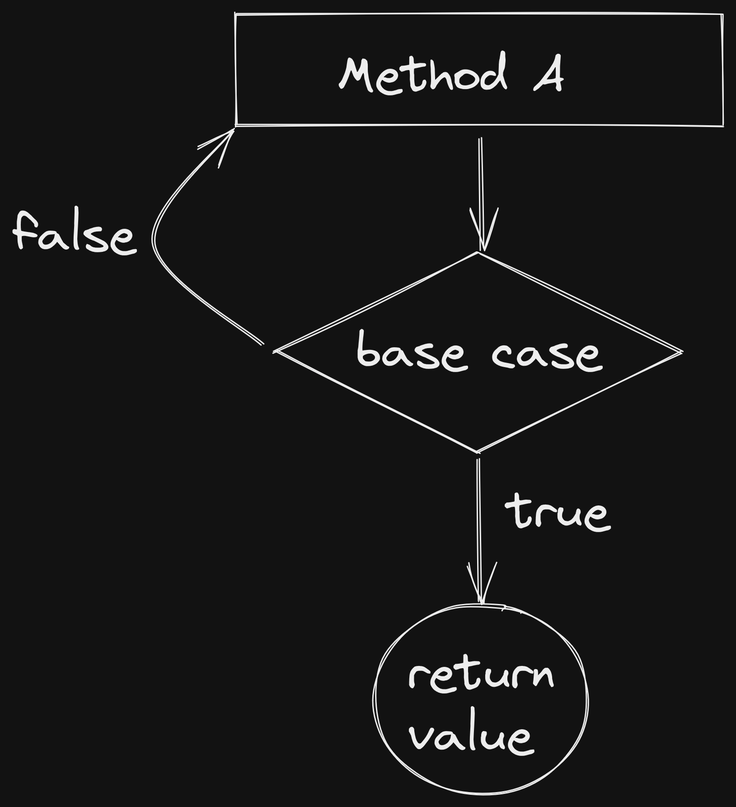
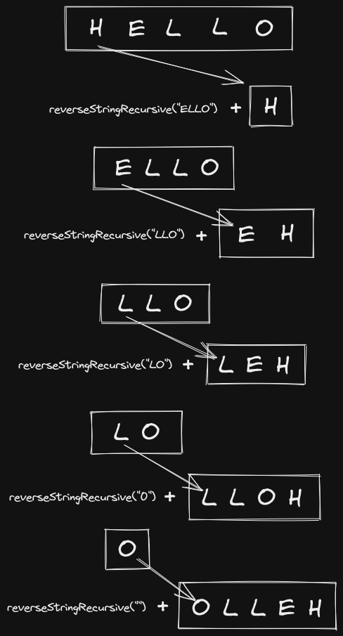

# Recursion
## What is recursion?
Recursion is the act of calling the same method internally multiple times to return an intended value.

Recursion can be deduced to the recursive property itself and a base case.  The **Base Case** is the condition in which the logic should end and close the loop. In the example below we will be looking at a problem in which recursion can be applied, how to implement a recursive process and the performance versus an iterative one (think conventional for loop).

## The problem
In this scenario, we will be looking at how to reverse a string.
```java 
public static String reverseStringRecursive(String s) {
	// base case
	// check if the input string is empty.
	if(s.isEmpty())
		return "";
	/*recursive logic
	* substring(1) excludes the first character while passing the rest.
	* then we append the character removed.
	*/ 
	return reverseStringRecursive(s.substring(1)) + s.charAt(0);
}
```

A good ideology to follow is establishing the base case first, "in my problem, what scenario would result in the function terminating?" In the example above, it would be removing a character in the string until the string is empty. So this is what you should check for, if the string is empty `return`.

Next, let us implement the logic. All we need to do is remove the first character in the string 1 by 1. Each time we call <strong>reverseStringRecursive()</strong> we just remove the first character. After this, we just have to append that character removed to the end of the string.

This can be confusing however think about it like this, the deeper we go into the method, the character will be inserted closer to the beginning of the string. Essentially getting to the base case happens first since <strong>reverseStringRecursive()</strong> gets called before appending the char when building the string. 

Let us take hello as an example:
```java
reverseStringRecursive("HELLO")
```
The logic would follow - "" + "O" + "L" + "L" + "E" + "H". The diagram I included makes it easy to understand how the characters get inserted into the string but you must understand that the "H" would be inserted after all the method calls get popped off the stack thus returning the reversed string. 



## Performance
Now since you understand the basics of recursion we will be building upon this example to understand performance. Recursion isn't constrained to a specific language, it can be implemented in most languages since it's more of a way of thinking than anything else. Results may vary depending on the compilers used however in most circumstances iteration outperforms recursion. This is because each time a recursive method is called it's building up the stack frame and when it is ending, the opposite has to happen, the teardown of the stack frame. This is time the CPU can be used to do other calculations. Other culprits can be pointed out that in an iterative process, the variables are most likely held in registers, and even if they exceed this, the variables can be stored in the primary cache. However, in a recursive process, all intermediary states of the variable are stored on the stack causing more memory accesses i.e. again CPU is fetching data when it could be performing other tasks. A few compilers allow for a "tail recursion" flag that optimizes the compiler's assumptions however this does not default and at best results in it being as quick as an iterative process.

To get a better understanding of the performance differences I constructed an iterative way to reverse a string to see the discrepancies.
```java
public class Example {
	public static void main(String[] args) {
		/* Create a consistent string with variable length to test
		 * 80 is an arbitrary value used to extend the string.
		 * Value should be >=1.
		 */
		String val = stringGenerator(80);
		
		// Start timer
		long startTime = System.nanoTime();
		
		reverseStringRecursive(val);
		// Print out the time taken for the recursive method to run.
		System.out.println("Recursive took: " + (System.nanoTime() - startTime) + " nanoseconds"); 
		
		// Reset timer
		startTime = System.nanoTime();
		
		reverseStringNormal(val);
		// Print out the time taken for the iterative method to run.
		System.out.println("Normal reverse took: " + (System.nanoTime() - startTime) + " nanoseconds");
	}
	
	public static String reverseStringRecursive(String s) {
		// base case
		// check if the input string is empty.
		if(s.isEmpty())
			return "";
		/*recursive logic
		* substring(1) excludes the first character while passing the rest.
		* then we append the character removed.
		*/ 
		return reverseStringRecursive(s.substring(1)) + s.charAt(0);
	}
	
	public static String reverseStringNormal(String s) {
		// init string that'll contain the reversed output.
		String reverse = "";
		/* In this for loop, we walk back from the end of the string.
		* Hence s.length()-1 is to get the last char in the string.
		*/
		for(int i = s.length()-1; i >= 0; i--) {
			// We then add the last char to the init string for every last char.
			reverse += s.charAt(i);
		}
		return reverse;
	}
	
	/* Simple method used to create a string A-Z upper and lower case with 
	 * a few special characters in ASCII.
	 * 
	 * It's recursive so it can vary in length for testing.
	 * 
	 * The logic in this method is unnecessary to understand for the lesson,
	 * any method that generates a consistent string will do.
	 */
	public static String stringGenerator(int num) {
		String s = "";
		if(num == 0)
			return "";
		for(int i = 65; i < 123; i++) {
			s += (char) i;
		}
		return s + stringGenerator(--num);
	}
}
```

Results:
``` java
Recursive took: 14958201 nanoseconds
Normal reverse took: 7688400 nanoseconds
```
Results will vary depending on computer specs however you can expect performance to be ~2x slower than the iterative one.

## Conclusion
Recursion should be implemented in specific circumstances and you should not force recursion, let it come out naturally, think of a file system, folders within folders is a good real-world example. You should remember that when using recursion, you are constantly building on the stack and if it gets too big will result in a stack overflow scenario. Using recursion also yields very high memory allocation so when memory (RAM) is a priority, this method should not be used.

## References
- https://web.mit.edu/6.005/www/fa15/classes/10-recursion/
- https://en.wikipedia.org/wiki/Tail_call
- https://www.geeksforgeeks.org/recursion-in-java/