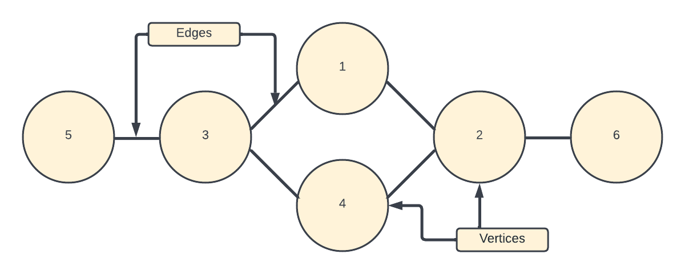

# What are BFS and DFS?

The best place to start is by describing what BFS and DFS stand for, **BFS** stands for **Breadth First Search *Traversal***, and **DFS** stand for **Depth First Search *Traversal***. As you can see by their names, BFS and DFS are traversal algorithms specifically for graphs. Before getting into how BFS and DFS work, let's first explain what the graph data structure is.


## Graph Data Structure

A Graph is a non-linear data structure consisting of vertices (nodes) and edges (lines that connect any two nodes). More formally a Graph is composed of a set of vertices( V ) and a set of edges( E ). The graph below would be denoted by:
V = {1, 2, 3, 4, 5, 6}
E = {(1,2), (1,3), (2,4), (2,6),(3,5),(3,4)}
G = {V, E}


## Coding a Graph

Let's walk through making a graph before talking about how to traverse through one, this should help when explaining BFS and DFS in the next section. We will start with talking about how to make the graph, for this example we will be creating a bidirectional graph. A bidirectional graph means that the edges are two-way roads, whereas in a unidirectional graph you would only be able to travel one way across each edge.

```java
class Graph<T> {
    // Instantiate a new hashmap, they are used to store edges in a graph
    private Map<T, List<T> > map = new HashMap<>();

    // This function adds a new vertex to the graph
    public void addVertex(T s) {
        map.put(s, new LinkedList<T>());
    }

    // This function calls the addVertex method if it exists in our map for our graph
    public void addEdge(T source, T destination) {
        if(!map.containsKey(source)) {
            addVertex(source);
        }
        // This function will add the edge between the source vertex and destination vertex
        if(!map.containsKey(destination)){
            addVertex(destination);
            map.get(source).add(destination);
            map.get(destination).add(source);
        }
    }
}

    // Now that we know how the code inside the graph class works, let us see how we would access them in our main driver.

public class Main {
    public static void main(String args[]) {
        // Instantiate our new graph
        Graph<Integer> g = new Graph<Integer>();

        // Adding our edges
        g.addEdge(0, 1);
        g.addEdge(0, 4);
        g.addEdge(1, 2);
        g.addEdge(1, 3);
        g.addEdge(1, 4);
        g.addEdge(2, 3);
        g.addEdge(3, 4);
    }
}
```
And just like that, you know how to make a graph in Java! Now that we've gone through the basics of graphs, let us talk about traversing through them.

## Sources

 - https://www.geeksforgeeks.org
 - https://www.tutorialspoint.com
 - https://www.softwaretestinghelp.com
