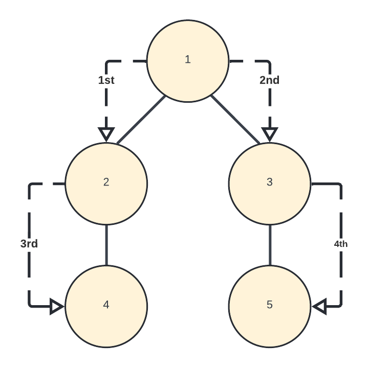
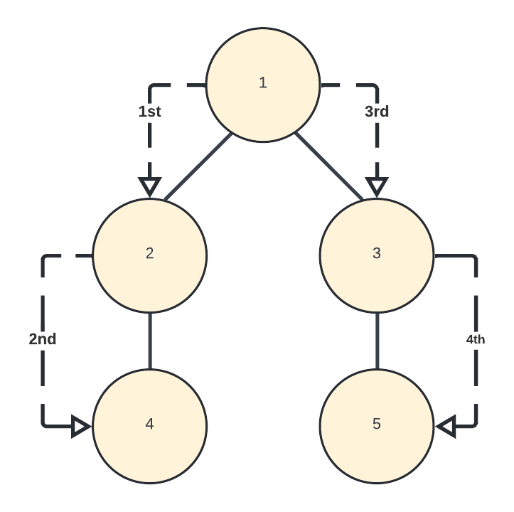

# Breadth First Search (BFS)

The Breadth First Search (BFS) traversal is an algorithm, which is used to visit all of the nodes of a given graph. In this traversal algorithm, one node is selected and then all of the adjacent nodes are visited one by one. After completing all of the adjacent vertices, it moves further to check other vertices and checks its adjacent vertices again.

## Visual Walkthrough

 1. We start at the top node
 2. Since there is only one node at the top of this graph, we go down to the next level
 3. Since there is a node next to this one, BFS will go to that one next
 4. Now that there are no more nodes in this level, BFS will move to the next layer
 5. Lastly, we will go to the last node in this row which also happens to be the last note in our graph
## Algorithm
```java
class Graph {

    // No. of vertices
    private int V;

    // Adjacency Lists
    private LinkedList<Integer> adj[]; 

    // Constructor
    Graph(int v) { 
        V = v;
        adj = new LinkedList[v];
        for (int i= 0; i<v; ++i)
        adj[i] = new LinkedList();
    }

    // Function to add an edge into the graph
    void addEdge(int v, int w) {
        adj[v].add(w);
    }

    // prints BFS traversal from a given source s
        void BFS(int s) {

        // Mark all the vertices as not visited(default as false)
        boolean visited[] = new boolean [V];

        // Create a queue for BFS
        LinkedList<Integer> queue = new LinkedList<Integer>();

        // Mark the current node as visited and enqueue it
        visited[s]= true; 
        queue.add(s);
        while (queue.size() != 0) {

            // Dequeue a vertex from queue and print it
            s = queue.poll();   
            System.out.print(s+" ");

            /* Get all adjacent vertices of the dequeued vertexes If an adjacent has not been visited, then mark it visited and enqueue it
            */
            Iterator<Integer> i = adj[s].listIterator();
            while (i.hasNext()) {
                int n = i.next();
                if (!visited[n]) {
                    visited[n] = true;
                    queue.add(n);
                }
            }
        }
    }

    // Driver method to
    public static void main(String args[])
    {
    Graph g = new Graph(4);
    g.addEdge(0,1);
    g.addEdge(0, 2);
    g.addEdge(1, 2);
    g.addEdge(2, 0);
    g.addEdge(2, 3);
    g.addEdge(3, 3);
    System.out.println("Following is Breadth First Traversal " + 
    "(starting from vertex 2)");
    g.BFS(2);
    }
}
```
```
Output:
Following is Breadth First Traversal (starting from vertex 2) 
2 0 3 1
```

# Depth First Search (DFS)


The Depth First Search (DFS) is a graph traversal algorithm. In this algorithm, one starting vertex is given, and when an adjacent vertex is found, it moves to that adjacent vertex first and tries to traverse in the same manner.

## Visual Walkthrough

 1. We start at the top node
 2. We would then go to the next deepest node on the left, in our case node 2
 3. Since there is an even deeper node on the left, we will go to that one before going through any nodes on the right
 4. Now that we have hit the deepest node, we will go back to the top and continue going through the nodes on the right side
 5. Lastly, we will go to the last node in this column which also happens to be the last note in our graph
## Types of DFS
-   Inorder Traversal (Left-Root-Right)
-   Preorder Traversal (Root-Left-Right)
-   Postorder Traversal (Left-Right-Root)
## Algorithm
```java
class Graph {
    //No. of vertices
    private int V; 

    private LinkedList<Integer> adj[];
    
    //Constructor
    @SuppressWarnings("unchecked") Graph(int v) { 
        V = v;
        adj =new LinkedList[v];
        for(int i = 0; i < v; ++i)
        adj[i] =` `new` `LinkedList();
    }

    //Function to add an edge into the graph
    void addEdge(int v, int w) { 
        //Add w to v's list
        adj[v].add(w); 
    }

    //A function used by DFS
    void DFSUtil(int v, boolean visited[]) { 
        //Mark the current node as visited and print it
        visited[v] = true; 
       
        System.out.print(v + " ");
        
        // Iterate for all vertices adjacent to this one
        Iterator<Integer> i = adj[v].listIterator(); 
        
        while(i.hasNext()) {
            int n = i.next();

            if(!visited[n])
            DFSUtil(n, visited);
        }
    }
    
    // The function to do DFS traversal. It uses recursive DFSUtil()
    void DFS(int v) { 
    
    // Mark all the vertices as not visited(false by default)
    boolean visited[] = new boolean[V]; 
    
    // Call the recursive helper function to print DFS traversal
    DFSUtil(v, visited); 
    }

    //Driver's Code
    public static void main(String args[]) {
    Graph g = new Graph(4);
    g.addEdge(0,1);
    g.addEdge(0,2);
    g.addEdge(1,2);
    g.addEdge(2,0);
    g.addEdge(2,3);
    g.addEdge(3,3);
    System.out.println("Following is Depth First Traversal " +
    "(starting from vertex 2)");
    
    //Function call
    g.DFS(2); 
    }
}
```
```
Output:
Following is Depth First Traversal (starting from vertex 2) 2 0 1 3
```
## Differences between BFS and DFS
|BFS|DFS|
|--|--|
|Breadth First Search|Depth First Search|
|Uses Queue to find the shortest path|Uses Stack to find the shortest path|
|Better when target is closer to Source|Better when target is far from source|
|As BFS considers all neighbors, it is not suitable for decision trees used in puzzle games|More suitable for decision trees. As with one decision, we need to traverse further to augment the decision|
|Slower|Faster|

## Real world examples
It's always difficult for me to imagine when I would use these in the job field, so to end things off I'd like to give some uses for each and how we can see them used in our daily lives.
### BFS
- **Peer to Peer Networks.**  In Peer to Peer Networks like BitTorrent, Breadth First Search is used to find all neighbor nodes.
- **Social Networking Websites:** In social networks, we can find people within a given distance ‘k’ from a person using Breadth First Search till ‘k’ levels.
- **GPS Navigation systems:**  Breadth First Search is used to find all neighboring locations.
- **Broadcasting in Network:**  In networks, a broadcasted packet follows Breadth First Search to reach all nodes.
-  **In Garbage Collection:**  Breadth First Search is used in copying garbage collection using Cheney’s algorithm. Breadth First Search is preferred over Depth First Search because of the better locality of reference
### DFS
 - **Detecting cycle in a graph** A graph has a cycle if and only if we see a back edge during DFS. So we can run DFS for the graph and check for back edges.
- **Path Finding**   We can specialize the DFS algorithm to find a path between two given vertices u and z.
    - Call DFS(G, u) with u as the start vertex
    - Use a stack S to keep track of the path between the start vertex and the current vertex
    - As soon as destination vertex z is encountered, return the path as the contents of the stack
- **Topological Sorting** Topological Sorting is mainly used for scheduling jobs from the given dependencies among jobs. In computer science, applications of this type arise in instruction scheduling, ordering of formula cell evaluation when recomputing formula values in spreadsheets, logic synthesis, determining the order of compilation tasks to perform in makefiles, data serialization, and resolving symbol dependencies in linkers.
- **Finding Strongly Connected Components of a graph**  A directed graph is called strongly connected if there is a path from each vertex in the graph to every other vertex.
- **Solving puzzles with only one solution** such as mazes, (DFS can be adapted to find all solutions to a maze by only including nodes on the current path in the visited set.)

## Sources

 - https://www.geeksforgeeks.org
 - https://www.tutorialspoint.com
 - https://www.softwaretestinghelp.com
 - https://www.geeksforgeeks.org
 - https://www.tutorialspoint.com
 - https://www.softwaretestinghelp.com
