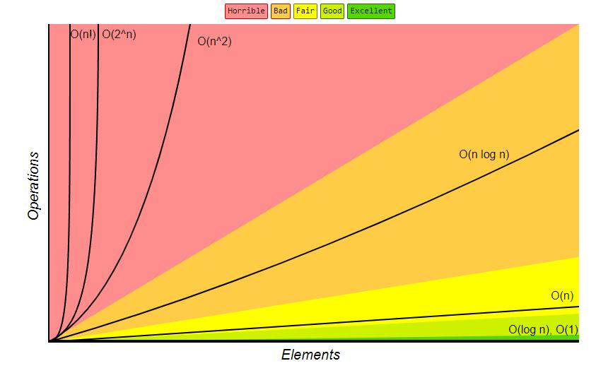
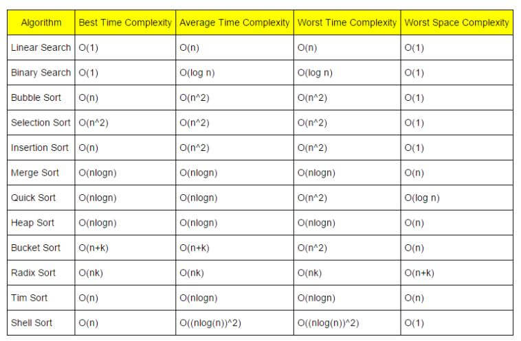
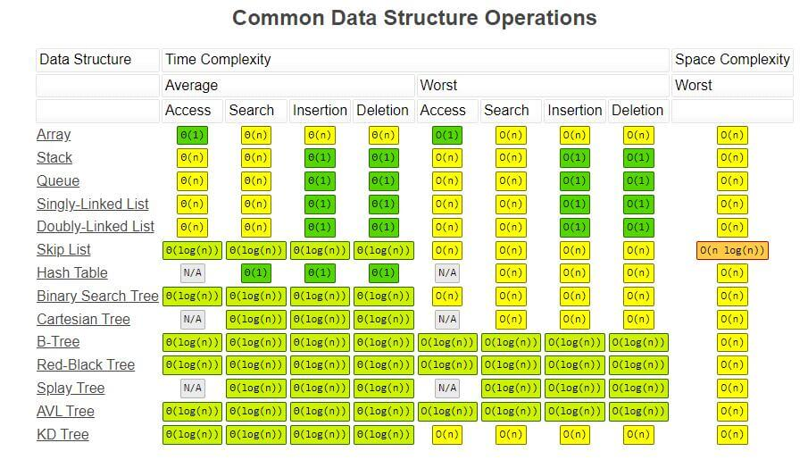
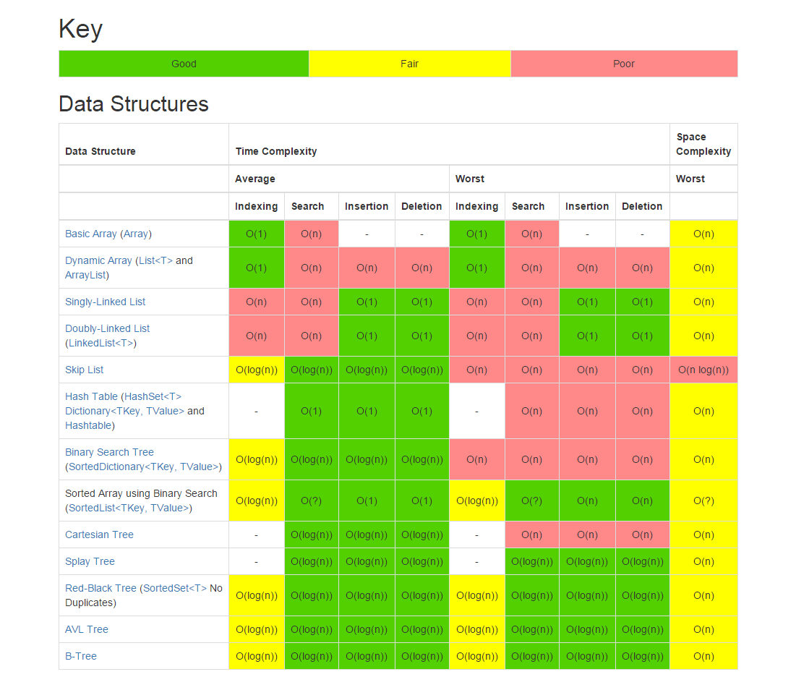
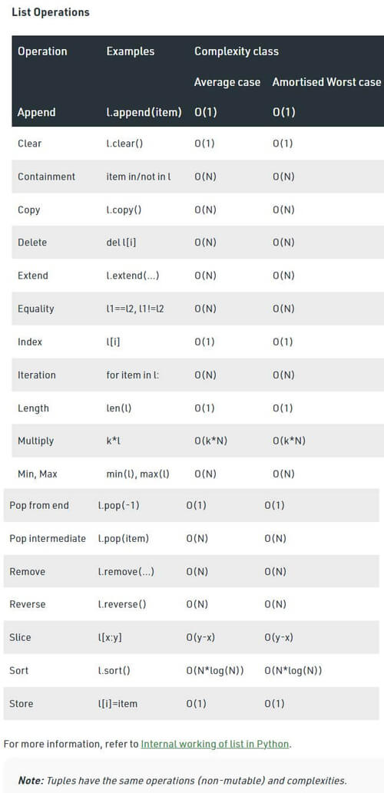
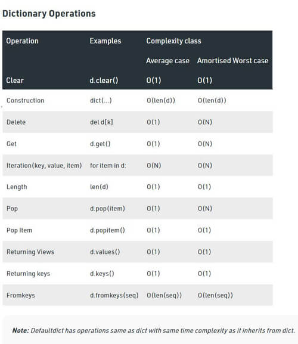
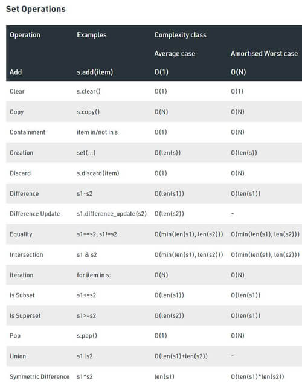

# Time Efficiency

When talking about an algorithm, you must have heard the word **Big O Notation** *-**at least one time. But what is a Big O Notation? From a programming concept, Big O notation used a sort of measurement unit for the efficiency of an algorithm. It is used to evaluate how quickly the runtime grows relative to the input data.

It is used to evaluate big data, which has a large input. Because of that, if the data input is small, Big O Notation will not be accurate. An example is Binary Search had a better time efficiency than Linear Search according to Big O notation, but if the data size is small, Linear Search is faster.

But how do we know which one is faster than the other? Here is the ascending order from the best to the worst complexity:
- Constant time O(1)
- Logarithmic O(log n)
- Linear O(n)  
- Linearithmic O(n log n)
- Quadratic O(n2) 
- Exponential O(2n) 
- Factorial O(!n)

And we also have the **Big O Complexity Chart** for more information about Big O Complexity Order:

Big O Notation is used to measure the complexity of an algorithm. But what is complexity? We have two types of complexity Big O notation used for measurement. That is **Time Complexity** and **Space Complexity**:
- **Time Complexity** is the time taken by the algorithm to execute each set of instructions measured as respected to n - the input’s size
- **Space Complexity** is the amount of memory consumed by the algorithm. It is composed of two different spaces: Auxiliary space and Input space. It is also measured with respect to n - the input’s size.

For space complexity, people only ask for the worst case. But for time complexity, there is a need for Worst, Average, and Best cases to analyze an algorithm:
- **Worst case** describes the worst possible state, with the maximum number of operations done
- **Average case** describes the expected performance of the algorithm 
- **Best case** describes the luckiest scenario where there is the minimum number of operations done

Not only do we have space and time complexity, but we also have best, worst, and average cases to remember for each data structure and algorithm. Isn’t that a lot of work to do? Why do we need to learn Big O notation? The answer is: Big O Notation provides us with a quick way to assess the speed – or more properly, the performance of an algorithm. It’ll show up in many interviews.

As a final note, here is some Big O notation efficiency for Common Data Structure and Array Sorting Algorithms for your reference.

## Searching and Sorting Algorithms Time Complexity

## Common Data Structure Operations Complexity

 

## Java Collection time efficiency

 **List**

|   |Get|Add|Remove|Contains|Next|Data Structure|
|---|---|---|---|---|---|---|
|ArrayList|O(1)|O(1)|O(n)|O(n)|O(1)|Array|
|LinkList|O(n)|O(1)|O(1)|O(n)|O(1)|Linked List|

 **Set**

|   |Add|Remove|Contains|Next|Size|Data Structure|
|---|---|---|---|---|---|---|
|TreeSet|O(log n)|O(log n)|O(log n)|O(log n)|O(1)|Red Black Tree|
|HashSet|O(1)|O(1)|O(1)|O(h/n)|O(1)|Hash Table|
|LinkedHashSet|O(1)|O(1)|O(1)|O(1)|O(1)|Hash Table+Linked List|
|EnumSet|O(1)|O(1)|O(1)|O(1)|O(1)|Bit Vector|

Note: h is the table capacity

**Map**

| |Get|ContainsKey|Next|Data Structure|
|---|---|---|---|---|
|HashMap|O(1)|O(1)|O(h/n)|Hash Table|
|LinkedHashMap|O(1)|O(1)|O(1)|Hash Table+Linked List|
|TreeMap|O(log n)|O(log n)|O(log n)|Red Black Tree|
|IdentityHashMap|O(1)|O(1)|O(h/n)|Array|
|WeakHashMap|O(1)|O(1)|O(h/n)|Hash Table|
|EnumMap|O(1)|O(log n)|O(log n)|Array|
|ConcurrentHashMap|O(1)|O(1)|O(/n)|Hash Table|
|ConcurrentSkipListMap|O(log n)|O(log n)|O(1)|Skip List|

Note: h is the table capacity

**Queue**

||Offer|Peak|Poll|Remove|Size|Data Structure|
|---|---|---|---|---|---|---|
|PriorityQueue|O(log n)|O(1)|O(log n)|O(n)|O(1)|Priority Heap|
|LinkedList|O(1)|O(1)|O(1)|O(1)|O(1)|Array|
|ArrayDequeue|O(1)|O(1)|O(1)|O(n)|O(1)|Linked List|
|ConcurrentLinkedQueue|O(1)|O(1)|O(1)|O(n)|O(n)|Linked List|
|ArrayBlockingQueue|O(1)|O(1)|O(1)|O(n)|O(1)|Array|
|PriorityBlockingQueue|O(log n)|O(1)|O(log n)|O(n)|O(1)|Priority Heap|
|SynchronusQueue|O(1)|O(1)|O(1)|O(n)|O(1)|None!|
|DelayQueue|O(log n)|O(1)|O(log n)|O(n)|O(1)|Priority Heap|
|LinkedBlockingQueue|O(1)|O(1)|O(1)|O(n)|O(1)|Linked List|

## C# Collection efficiency
 

## Python built-in data structure efficiency

 
 
 