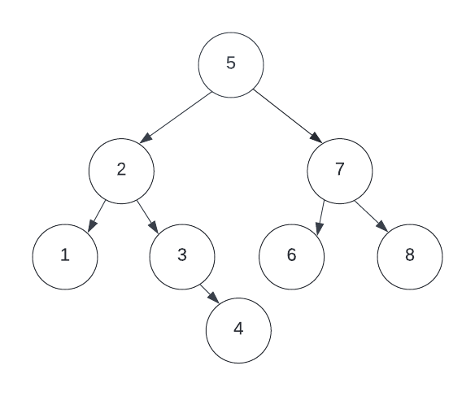
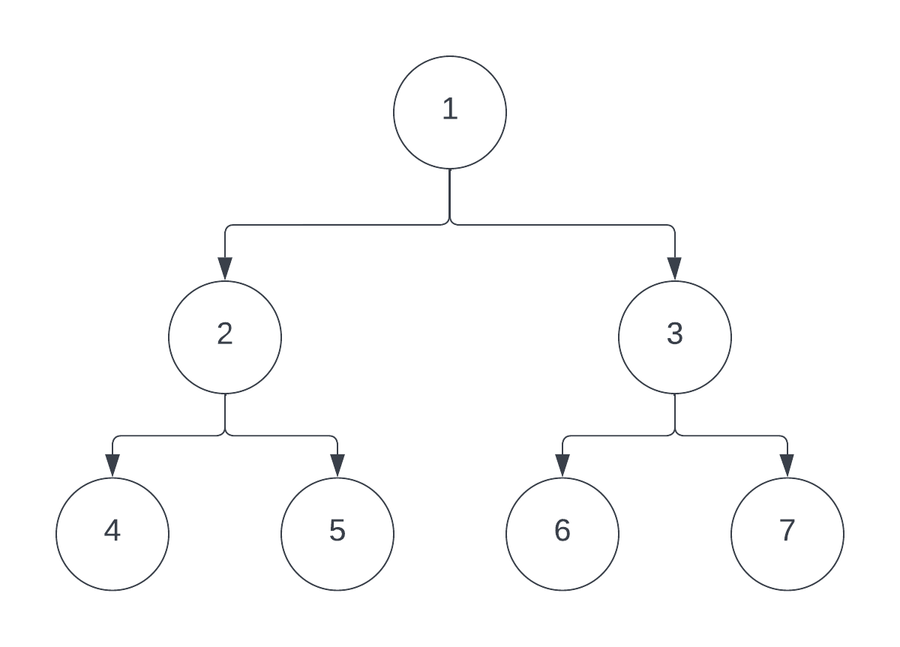
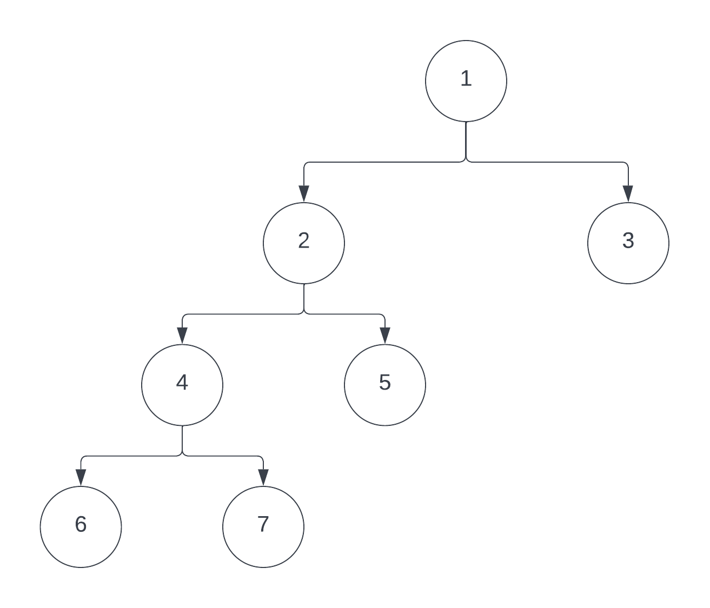
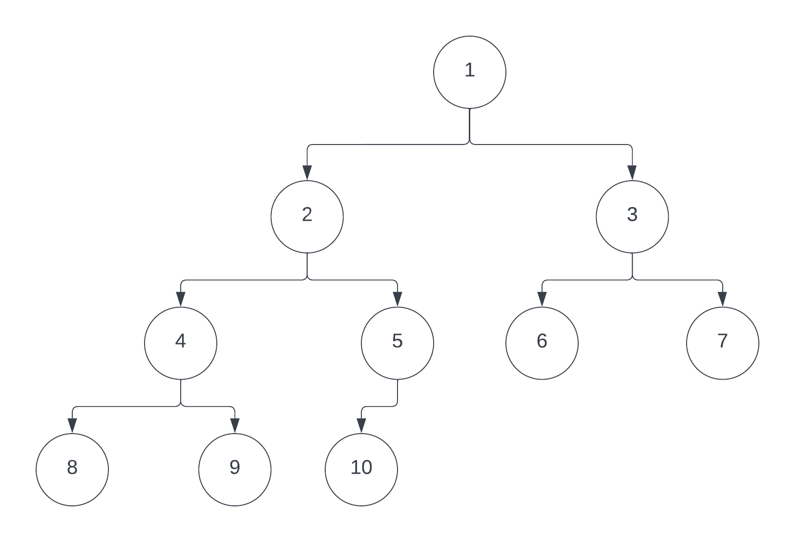
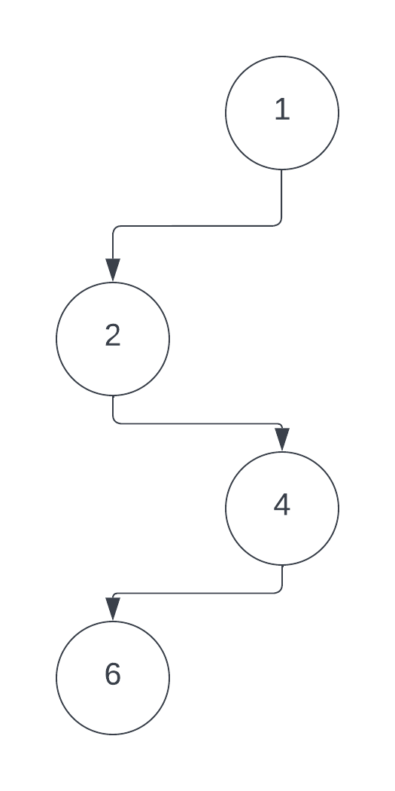
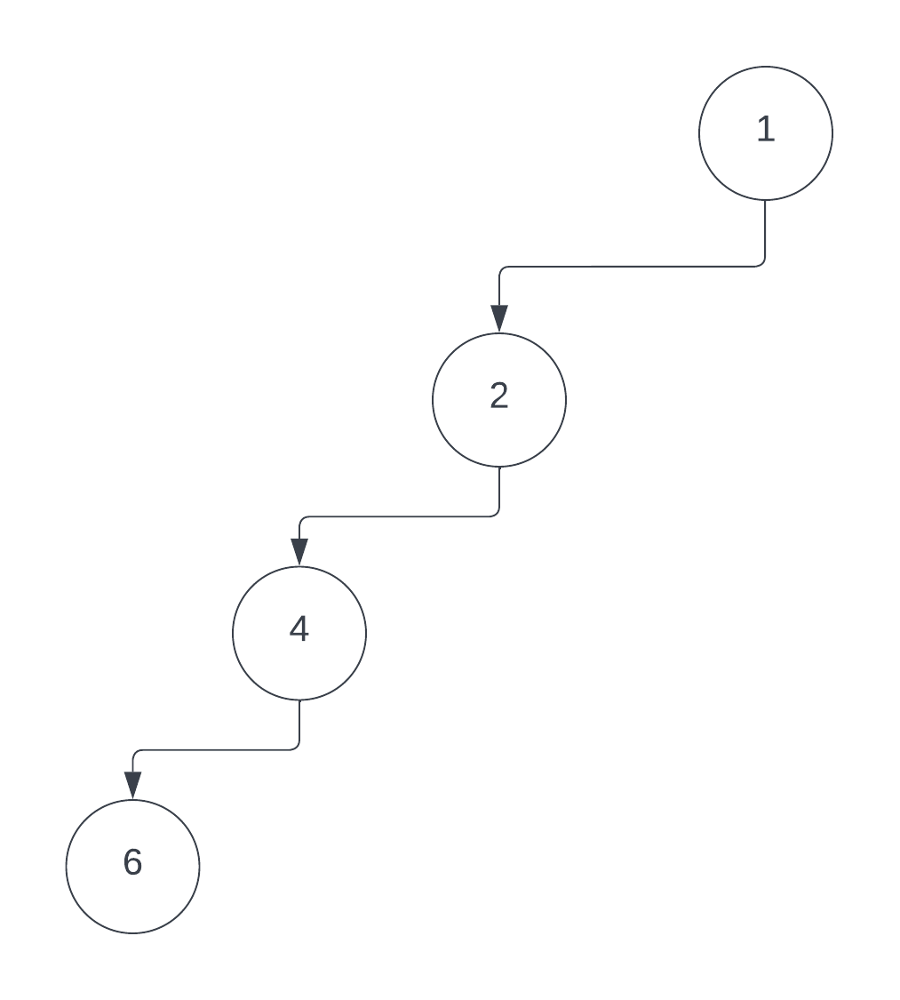

# Binary Tree

## Introduction

In this module, we will be discussing a simple but effective way to organize data in a non-linear fashion. A Binary Tree is a data structure where each node of data has no more than two corresponding "child" nodes. This makes it different from other algorithms like arrays and linked lists which organize data linearly.

Each node includes 3 parts, the data, a pointer to a left node, and a pointer to a right node.
This data structure is hierarchical, meaning that data is linked in a Parent/Child format, while linear data presents all data on the same level. This makes it useful for storing information that naturally forms a hierarchy, like a computer’s file system. Binary tree is also useful as it is quicker to search than Linked Lists, but slower than arrays.

## Types of Trees

There are various common types of Binary Trees.

The Full Binary Tree is a Binary Tree where each node has either 2 child nodes or no child nodes

A Complete Binary tree is similar to a full Binary Tree, but every level of the tree must be filled, and every node must lean left.

A complete Binary Tree is when all the levels are filled, and all nodes are as left as possible. The last node may not have a right node. (Complete Trees are not necessarily full Trees)

A Perfect Tree is a Binary Tree with all internal nodes have 2 child nodes, and all leaf nodes are at the same level.

A Balanced Tree is a tree in which the height of a left and right subtree cannot differ more than one node.

Unbalanced trees are simply the opposite; They are trees in which the left and right subtrees differ by more than one node

This example of a Full Tree is also a balanced tree.

A Pathological Tree is a tree where every Node only has 1 Child node.

A Skewed Pathological Tree is when every node has only 1 child node always either on the left or right.

## Traversal

Trees can be traversed in a variety of ways, unlike in linear data structures like Arrays, or Linked Lists. 

Methods of traversal include:
In-Order Traversal. In this method, the left subtree is visited first then the original root node, then the right subtree

In this example, we would start with the left sub tree (2,4,5), move to the root (1), then traverse the right subtree (3,6,7)
Therefore, the output of in-order traversal will be 2,4,5,1,3,6,7.

Pre-Order traversal. In Pre-Order traversal we start at the root and then move to the left subtree, then the right subtree.

In this example we would start at 1, then move to the left subtree 2, and then the right subtree.
The output in this traversal would be 1,2,4,5,3,6,7.

Post Order traversal starts from the Left subtree, and then moves to the right subtree, then move to the root.
This output would be 4,5,2,6,7,3,1

