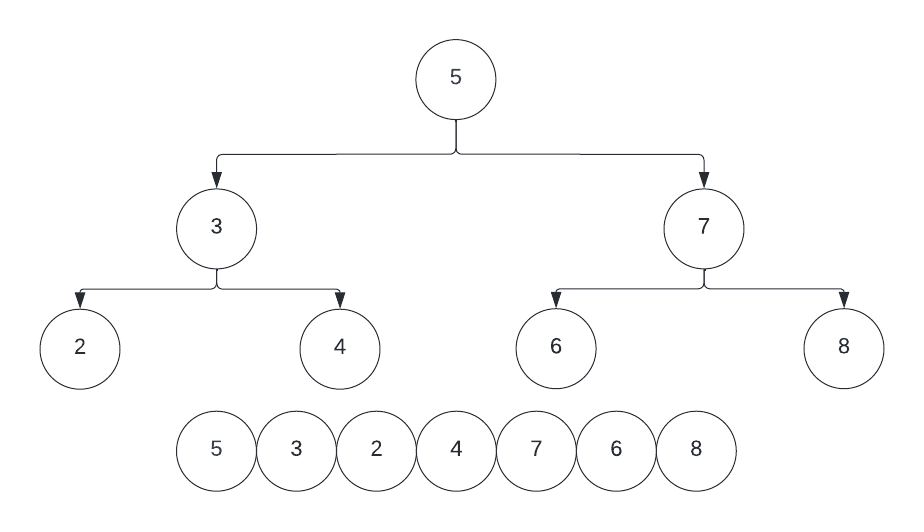
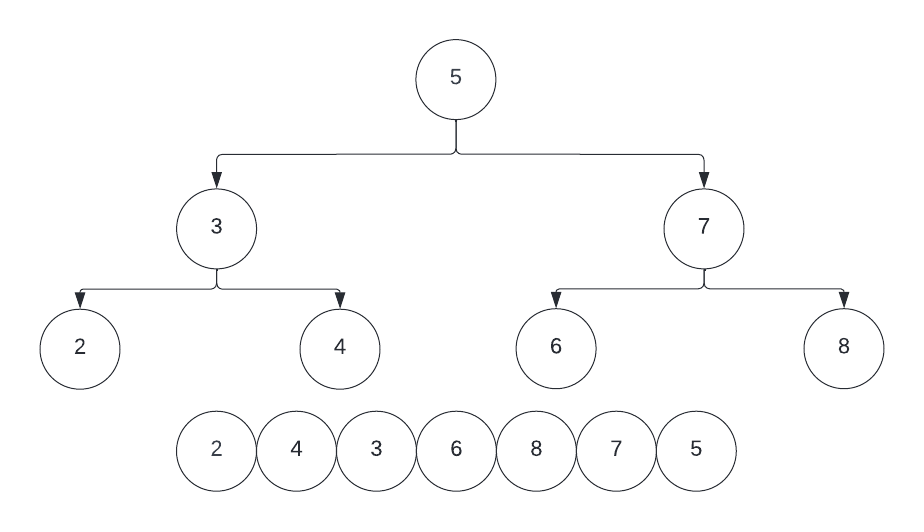

# Binary Tree

## Introduction

In this module, we will be discussing a simple but effective way to organize data in a non-linear fashion. A Binary Tree is a data structure where each node of data has no more than two corresponding "child" nodes. This makes it different from other algorithms like arrays and linked lists which organize data linearly.

Each node includes 3 parts, the data, a pointer to a left node, and a pointer to a right node.
This data structure is hierarchical, meaning that data is linked in a Parent/Child format, while linear data presents all data on the same level. This makes it useful for storing information that naturally forms a hierarchy, like a computer’s file system. Binary tree is also useful as it is quicker to search than Linked Lists, but slower than arrays.

## Types of Trees

There are various common types of Binary Trees.

The Full Binary Tree is a Binary Tree where each node has either 2 child nodes or no child nodes

A Complete Binary tree is similar to a full Binary Tree, but every level of the tree must be filled, and every node must lean left.

A complete Binary Tree is when all the levels are filled, and all nodes are as left as possible. The last node may not have a right node. (*Complete Trees are not necessarily full Trees*)

A Perfect Tree is a Binary Tree with all internal nodes have 2 child nodes, and all leaf nodes are at the same level.

A Balanced Tree is a tree in which the height of a left and right subtree cannot differ more than one node.

Unbalanced trees are simply the opposite; They are trees in which the left and right subtrees differ by more than one node

This example of a Full Tree is also a balanced tree.

A Pathological Tree is a tree where every Node only has 1 Child node.

A Skewed Pathological Tree is when every node has only 1 child node always either on the left or right.

## Orginization of a Tree

The organization of a Binary Tree does not follow most of the examples above. Usually, they follow this:

Here the Tree's nodes all fall under the logic that **smaller values** fall to the **left**, and **larger values** to the **right**.

As seen in this example above, our root node is the first node `5`, and stands in the **middle** in relation to the other values. While all the values to the right of it are larger, and to the left is lesser.

## Traversal

Trees can be traversed in a variety of ways, unlike in linear data structures like Arrays, or Linked Lists. 

Methods of traversal include:
**In-Order Traversal:** In this traversal, the order in which nodes are *listed* are from least to greatest. Thus, we traverse to the deepest left node first and then slowly move back up and then down into the right half of the tree. 

**Pre-Order traversal:** In this traversal, we start at the root and then move to the left subtree, then the right subtree.

**Post Order traversal:** This traversal traverses through the subtrees in reverse first. First the left then the right, and then finlly reaches the root node.

## Binary Tree Methods

- **Insert** method that creates a new node to be inserted into the binary tree with standard orginization as described above.
- **Retrival** method searches for, and returns a specific node in a binary tree.
- **Deletion** method is deleting a node from the binary tree, and is one of the hardest to implement. You will not have to attempt to perform this method for any of the labs of this module. However, understanding the overall workings of it is required.

# Labs
**To access the labs via Replit.com, you must first [join the Post-Training Replit Team by clicking here](https://replit.com/teams/join/ovnxpukpgnmqolcfnlrlxvygvzunwhgo-staging-foundations-h2-22) and signing up for a free Replit.com account with your ==Revature.net== Email. If you do not use your Revature email, your progress may not be tracked by our systems**

## Insertion
[REPLIT]()
[Source]()

## Retrevial
[REPLIT]()
[Source]()

Once finished with the lab here, continue to the following section to read a more in-depth description of this Algorithm.